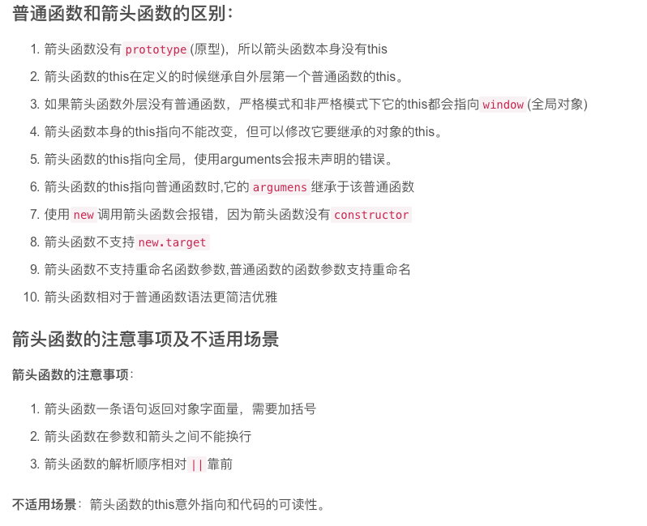
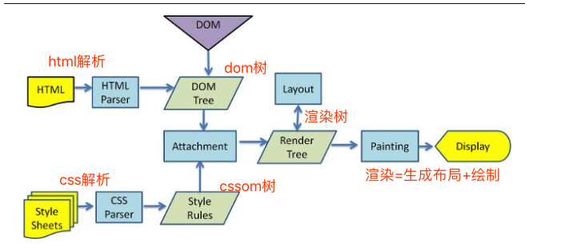

# frontend-daily-learning
js, css, html的日常学习记录，希望大家多多交流

```bash
http-server -a 127.0.0.1 -p 9001

python -m SimpleHTTPServer 8888 #Serving HTTP on 0.0.0.0 port 8888 ...

```


## npm报错

```Error: Cannot find module 'ajv'
    at Function.Module._resolveFilename (module.js:485:15)
    at Function.Module._load (module.js:437:25)
    at Module.require (module.js:513:17)
    at require (internal/module.js:11:18)
    at Object.<anonymous> (/home/user/GIT/project/node_modules/webpack/lib/validateSchema.js:7:13)
    at Module._compile (module.js:569:30)
    at Object.Module._extensions..js (module.js:580:10)
    at Module.load (module.js:503:32)
    at tryModuleLoad (module.js:466:12)
    at Function.Module._load (module.js:458:3)
npm ERR! code ELIFECYCLE
npm ERR! errno 1
```

解决：
```nodemon
cnpm install npm -g
```
### 闭包异步面试题
https://www.jianshu.com/p/76857b595f80

** 箭头函数与普通函数对比分析？
https://blog.csdn.net/OBKoro1/article/details/88732010

1. 箭头函数没有prototype(原型)，所以箭头函数本身没有this
let a = () =>{};
console.log(a.prototype); // undefined

2.函数的length属性，不包括 rest 参数
(function(...a) {}).length  // 0
(function(a, ...b) {}).length  // 1
(function(a, b, ...c) {}).length  // 2

3.使用new调用箭头函数会报错
let a = () => {};
let b = new  a(); // a is not a constructor



** 浏览器重绘重排与优化
https://blog.csdn.net/OBKoro1/article/details/85057490


