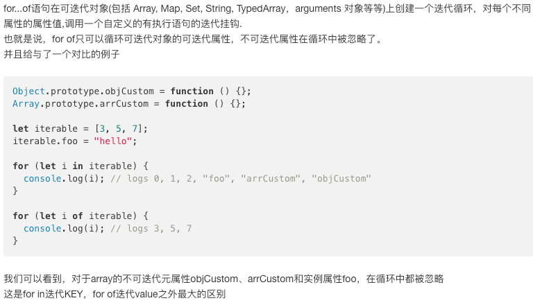

# readme.md
https://developer.mozilla.org/zh-CN/docs/Web/JavaScript/Reference/Global_Objects/Array

pop,push,
unshift,shift,
concat,slice,filter,join,map,forEach,some,every,entries,
find,findIndex,
fill,flat,flatMap,
includes,indexOf,keys,lastIndexOf,
reduce,reduceRight,
sort,splice,values,
toString,toLocaleString,
reverse,
copyWithin,
toSource,
from,
isArray,
observe,//废弃了
of
[@@iterator] // arr[Symbol.iterator]();数组的 iterator 方法，默认情况下与 values() 返回值相同

```markdown
Array.of(7) // [7]
Array(7) // [,,,,,,]
Array.from({length:7}) [undefined,undefined,undefined,undefined,undefined,undefined,undefined]

let arr = [
    {name:'alex1',id:'123'},
    {name:'alex2',id:'124'},
    {name:'alex3',id:'125'}
]

相同：
map,filter,forEach 都可以通过arr[index]索引可以修改原数组；
数组的迭代方法：every、filter、forEach、map、some
均不能使用break或者continue进行中断循环。只有for循环才可以使用break或者continue

不同：
map返回一个长度跟原来数组一样的新数组，没写return，则返回数组的值都是[undefined,...,]；
filter返回符合过滤条件的数组<=原数组，没有return，则返回[];
forEach没有返回值，不管写不写return，都是返回undefined；

// for in是遍历键名，for of是遍历键值。

let arr = [
    {name:'alex1',id:'123'},
    {name:'alex2',id:'124'},
    {name:'alex3',id:'125'}
]
es5:
forEach((item,index,curr)=>{ curr[index].gender = 'male' }); 
some,every,reduce,join,
for(let key in arr) { // 遍历对象方法
    console.log(arr[key],key); // key为索引 ，arr[key] = item;
}
es6:
for-of
for(let key of arr) {
    console.log(key); // key为item
}

var student={
    name:'wujunchuan',
    age:22,
    locate:{
    country:'china',
    city:'xiamen',
    school:'XMUT'
    }
}
for(var key of Object.keys(student)){
    //使用Object.keys()方法获取对象key的数组
    console.log(key+": "+student[key]);
}
Array.find( v => v.id === '123'); // 返回id为123的对象；
Array.findIndex( v => v.id === '123'); // 返回索引

Array.map((item,index,curr)=>{ return item }); //返回新数组：实现深克隆数组或者类数组；哈哈
es7:

es8：

es9:

es10:
Array.flat(2);// 扁平化数组；参数为多少维数组；
例如：
var arr = [ [123, 23], [1], 1, [0], 4 ];
var arr2 = [ [123,[3, 666], 23], [1], 1, [0], 4 ];
console.log(arr.flat(2)); // [123, 23, 1, 1, 0, 4];
console.log(arr2.flat(3)); // [123, 3, 666, 23, 1, 1, 0, 4];
```


## [].slice.call(arguments,1)的理解
[参考](https://segmentfault.com/q/1010000005643934)

如果不给slice()传递任何参数，它就会从头到尾截取所有元素。
利用这一点，我们可以很容易地复制一个Array：深克隆


## bind call apply区别说明
https://segmentfault.com/a/1190000012772040

```html
所以说
[].slice.call(arguments, 1);
或者
Array.prototype.slice.call(arguments,1);
实际上相当于（并不一定等同于）：
arguments.slice(1);
```


* polyfill看slice实现
```js
(function () {
  'use strict';
  var _slice = Array.prototype.slice;

  try {
    // Can't be used with DOM elements in IE < 9
    _slice.call(document.documentElement);
  } catch (e) { // Fails in IE < 9
    // This will work for genuine arrays, array-like objects, 
    // NamedNodeMap (attributes, entities, notations),
    // NodeList (e.g., getElementsByTagName), HTMLCollection (e.g., childNodes),
    // and will not fail on other DOM objects (as do DOM elements in IE < 9)
    Array.prototype.slice = function(begin, end) {
      // IE < 9 gets unhappy with an undefined end argument
      end = (typeof end !== 'undefined') ? end : this.length;

      // For native Array objects, we use the native slice function
      if (Object.prototype.toString.call(this) === '[object Array]'){
        return _slice.call(this, begin, end); 
      }

      // For array like object we handle it ourselves.
      var i, cloned = [],
        size, len = this.length;

      // Handle negative value for "begin"
      var start = begin || 0;
      start = (start >= 0) ? start : Math.max(0, len + start);

      // Handle negative value for "end"
      var upTo = (typeof end == 'number') ? Math.min(end, len) : len;
      if (end < 0) {
        upTo = len + end;
      }

      // Actual expected size of the slice
      size = upTo - start;

      if (size > 0) {
        cloned = new Array(size);
        if (this.charAt) {
          for (i = 0; i < size; i++) {
            cloned[i] = this.charAt(start + i);
          }
        } else {
          for (i = 0; i < size; i++) {
            cloned[i] = this[start + i];
          }
        }
      }

      return cloned;
    };
  }
}());
```

## call、apply和bind方法的用法以及区别
[参考](https://www.jianshu.com/p/bc541afad6ee)

```html
bind
和call很相似，第一个参数是this的指向，从第二个参数开始是接收的参数列表。区别在于bind方法返回值是函数以及bind接收的参数列表的使用。

apply
apply接受两个参数，第一个参数是要绑定给this的值，第二个参数是一个参数数组。当第一个参数为null、undefined的时候，默认指向window。

call 
call 方法第一个参数是要绑定给this的值，后面传入的是一个参数列表。当第一个参数为null、undefined的时候，默认指向window。
```

```js

    1.
       Function.prototype.softBind = function(obj){
           var fn = this;
           var curried = [].slice.call(arguments,1);
           var bound = function(){
               return fn.apply(
                   (!this || this === (window || global)) ? obj : this,
                   curried.concat.apply(curried,arguments)
               )
           };
           bound.prototype = Object.create(fn.prototype);
           return bound;
       }
    

    2.
       Function.prototype.mybind = function (context) {
           if (typeof this !== "function") {
               throw new Error(this + "is not a function");
           }
           var self = this;
           var args = [];
           for (var i = 1, len = arguments.length; i < len; i++) {
               args.push(arguments[i]);
           }
        
           var fbound = function () {
               var bindArgs = Array.prototype.slice.call(arguments);
               self.apply(this instanceof self ? this : context, args.concat(bindArgs));
           }
           fbound.prototype = Object.create(self.prototype);
           //返回的函数不仅要和 被调函数的函数体相同，也要继承人家的原型链
           return fbound;
       }

```


/*此处的返回值是true*/
   [].slice === Array.prototype.slice;
   
/*此处的返回值是true*/
   ''.slice === String.prototype.slice;

## es6 --- set
https://www.cnblogs.com/liuna/p/6171003.html

1.key方法、value方法、entries方法返回的都是遍历器对象。由于Set结构没有键名，只有键值（或者说键名和键值是同一个值），所以key方法和value方法的行为完全一致。
2.Set.prototype[Symbol.iterator] === Set.prototype.values === Set.prototype.keys
##### 由于两个空对象不相等，所以它们被视为两个值（与原生js一致）
##### 在 Set 内部，两个NaN是相等（与原生js不一致）


```js
var set = new WeakSet([{name:'alex',data:{
time:'2018-11-30',dataList:[{id:1,value:'test1'},{id:2,value:'test2'},{id:3,value:'test3'}]}},{age:23},{gender:'male'}]);

var obj = {name:'alex4444-7777777',data:{
time:'2018-11-30',dataList:[{id:1,value:'test1'},{id:2,value:'test2'},{id:3,value:'test3'}]}}
set.add(obj);
console.log(set); // ...
console.log(set.has(obj)); // true
```

扁平化多维数组数组：
### 1.
```js
var result = [];
function unfold(arr){
     (typeof arr != 'object' || arr == null)
      && result.push(arr);
     if(!Array.isArray(arr)){
         result.push(arr);
     }
     for(var i=0; i< arr.length; i++){
         if(typeof arr[i]=="object") {
              unfold(arr[i]);
         } else {         
             result.push(arr[i]);
         }
     }
     return result;
}
var arr = [1,3,4,5,[6,[0,1,5],9],[2,5,[1,5]],[5]];
unfold(arr);
console.log(result);
// [1, 3, 4, 5, 6, 0, 1, 5, 9, 2, 5, 1, 5, 5]
```
### 2.
```js
var c=[1,3,4,5,[6,[0,1,5],9],[2,5,[1,5]],[5]];

var b = c.toString().split(',')
```
### 3.
```js
var arr=[1,3,4,5,[6,[0,1,5],9],[2,5,[1,5]],[5]];

const flatten = arr => arr.reduce((a, b) => a.concat(Array.isArray(b) ? flatten(b) : b), []);

var result = flatten(arr)
```

### 4.

* 4.1 统计数组中相同项的个数 很多时候，你希望统计数组中重复出现项的个数然后用一个对象表示。那么你可以使用reduce方法处理这个数组。 下面的代码将统计每一种车的数目然后把总数用一个对象表示。
```node
var cars = ['BMW','Benz', 'Benz', 'Tesla', 'BMW', 'Toyota'];
var carsObj = cars.reduce(function (obj, name) { 
  obj[name] = obj[name] ? ++obj[name] : 1;
 return obj;
}, {});
carsObj; // => { BMW: 2, Benz: 2, Tesla: 1, Toyota: 1 }
```

* 4.2 使用reduce匹配圆括号 reduce的另外一个用途是能够匹配给定字符串中的圆括号。对于一个含有圆括号的字符串，我们需要知道(和)的数量是否一致，并且(是否出现在)之前。 下面的代码中我们使用reduce可以轻松地解决这个问题。我们只需要先声明一个counter变量，初值为0。在遇到(时counter加一，遇到)时counter减一。如果左右括号数目匹配，那最终结果为0。
```js
//Returns 0 if balanced.
const isParensBalanced = (str) => {
 return str.split('').reduce((counter, char) => {
  if(counter < 0) { //matched ")" before "("
   return counter;
  } else if(char === '(') {
   return ++counter;
  } else if(char === ')') {
   return --counter;
  } else { //matched some other char
   return counter;
  }
   
 }, 0); //<-- starting value of the counter
}
isParensBalanced('(())') // 0 <-- balanced
isParensBalanced('(asdfds)') //0 <-- balanced
isParensBalanced('(()') // 1 <-- not balanced
isParensBalanced(')(') // -1 <-- not balanced
```


### Array.sort()

