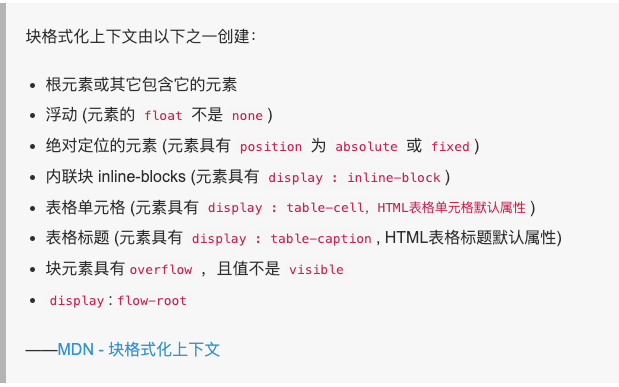

# 脱离文档流的css属性：触发BFC机制
https://blog.csdn.net/ivana_zyf/article/details/78940251

difficult: https://www.jianshu.com/p/5583ee91217e

### 1.浮动：float不为none；
* 注意：使用float脱离文档流时，其他盒子会无视这个元素，
但其他盒子内的文本依然会为这个元素让出位置，环绕在该元素的周围。

### 2.定位：position不为static；

### 3.display不为block
 (table-cell，table-caption，inline-block, flex, inline-flex,flow-root)

### 4.overflow不为visible
（hidden，auto，scroll）

### 5.fieldset元素



```md
渲染流程基本上四个步骤： 
1.计算CSS样式 
2.构建Render Tree 
3.Layout – 定位、大小，换行，（position, overflow等属性） 
4.正式开始
```

* 什么是 BFC

   BFC（Block Formatting Context）格式化上下文，是 Web 页面中盒模型布局的 CSS 渲染模式，指一个独立的渲染区域或者说是一个隔离的独立容器。
* 形成 BFC 的条件

   * 浮动元素，float 除 none 以外的值
   * 定位元素，position（absolute，fixed）
   * display 为以下其中之一的值 inline-block，table-cell，table-caption
   * overflow 除了 visible 以外的值（hidden，auto，scroll）
* BFC 的特性
   * 内部的 Box 会在垂直方向上一个接一个的放置。
   * 垂直方向上的距离由 margin 决定
   * bfc 的区域不会与 float 的元素区域重叠。
   * 计算 bfc 的高度时，浮动元素也参与计算
   * bfc 就是页面上的一个独立容器，容器里面的子元素不会影响外面元素。
