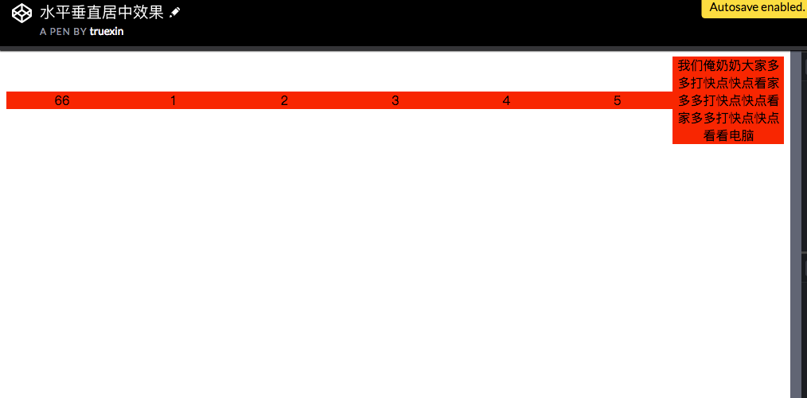
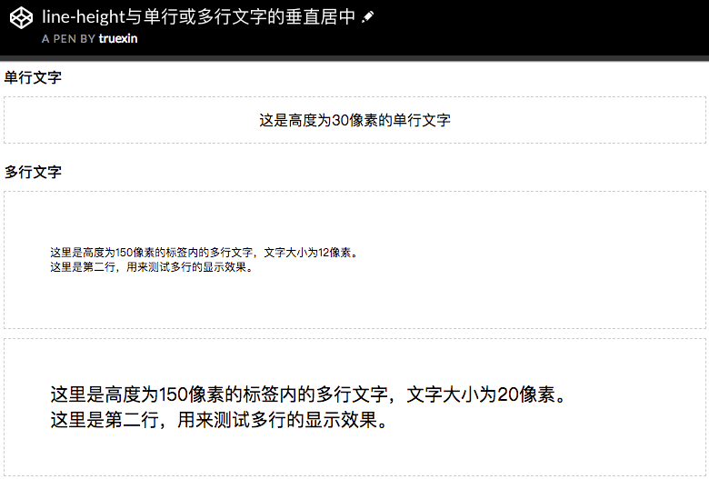
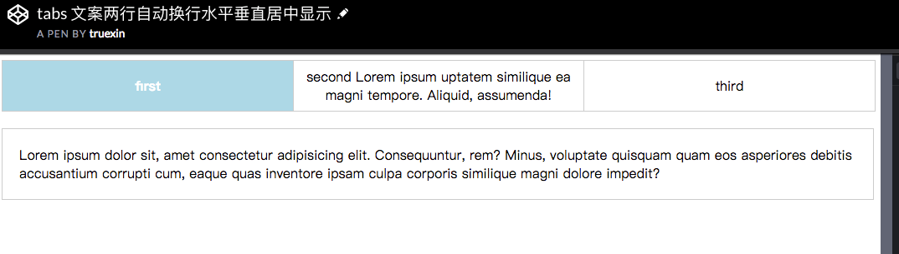
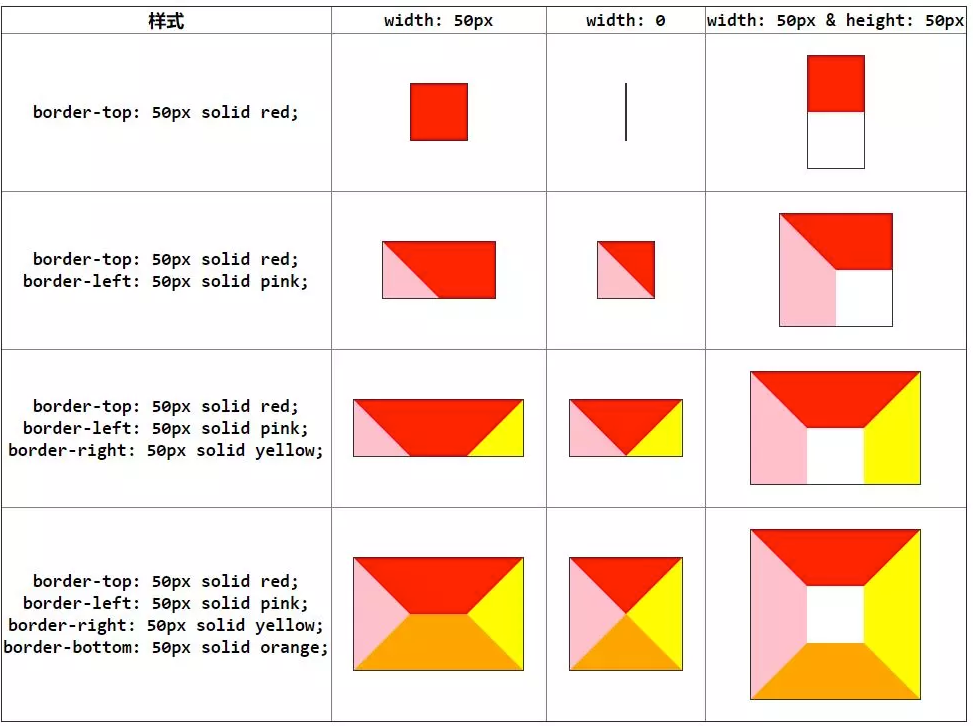

### 效果1：水平垂直居中效果

> 在线编辑：https://codepen.io/truexin/pen/wxvaJO

### 效果2：line-height与单行或多行文字的垂直居中

> 在线编辑：https://codepen.io/truexin/pen/LBpYze

### 效果3：tabs 文案两行自动换行水平垂直居中显示

> 在线编辑：https://codepen.io/truexin/pen/KBVePv

```参考链接：```
> https://www.zhangxinxu.com/wordpress/2009/08/%E5%A4%A7%E5%B0%8F%E4%B8%8D%E5%9B%BA%E5%AE%9A%E7%9A%84%E5%9B%BE%E7%89%87%E3%80%81%E5%A4%9A%E8%A1%8C%E6%96%87%E5%AD%97%E7%9A%84%E6%B0%B4%E5%B9%B3%E5%9E%82%E7%9B%B4%E5%B1%85%E4%B8%AD/

> https://www.zhangxinxu.com/wordpress/2009/11/css%E8%A1%8C%E9%AB%98line-height%E7%9A%84%E4%B8%80%E4%BA%9B%E6%B7%B1%E5%85%A5%E7%90%86%E8%A7%A3%E5%8F%8A%E5%BA%94%E7%94%A8/

### 效果4.去除inline-block间隙
参考：https://www.zhangxinxu.com/wordpress/2012/04/inline-block-space-remove-%E5%8E%BB%E9%99%A4%E9%97%B4%E8%B7%9D/

### 效果5.border实现三角形

```css
span {
    width: 0;
    height: 0;
    border-top: 40px solid transparent;
    border-left: 40px solid transparent;
    border-right: 40px solid transparent;
    border-bottom: 40px solid #ff0000;
}
```
