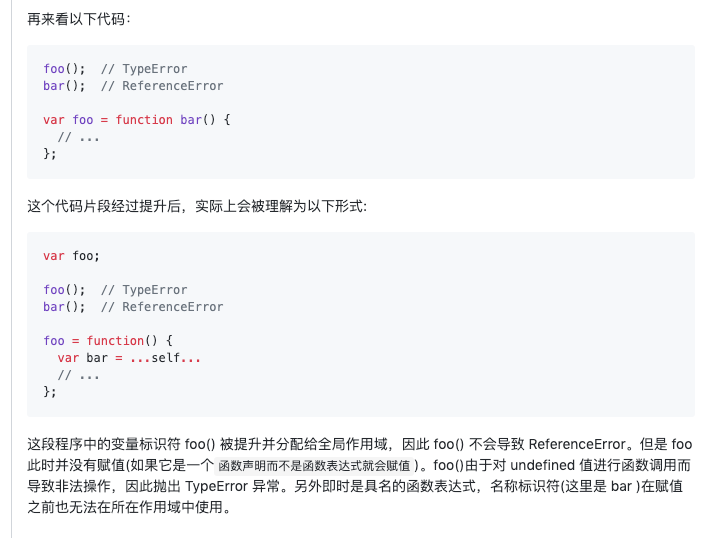
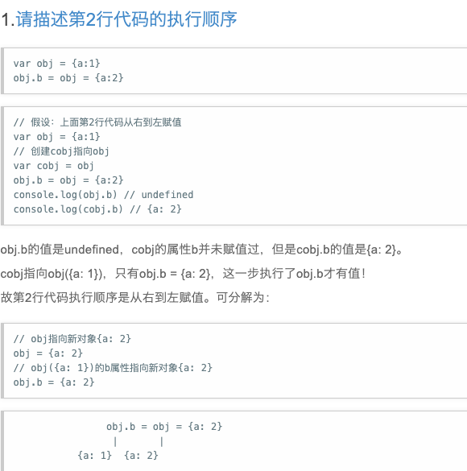

## 1.快速理解JavaScript 中的 LHS 和 RHS 查询

https://segmentfault.com/a/1190000010645079





## 2.操作符 + 与 {} / []
http://2ality.com/2012/01/object-plus-object.html
```
并不仅是在console里{}被解析为代码块，
而是在JavaScript的解析器中{}被解析为代码块，如果外面加上（），
({} + 1)/( 1 + {})中括号里面的内容则被解析成表达式，
表达式中没有语句块，所以+作为二元运算符，{}作为运算符的操作数解析而不是空代码块。

{} + 1,根据解析的顺序，{}作为空代码块被忽略，实际上就是 +1
1 + {},+被解析成二元运算符，然后解析到{}，
就相等于一个primitiveValue + objectValue

{} + {} -> NaN ,第一个{}被解析成空代码块，+解析成一元运算符，
相当于+{}，强制转成数字。
（{} + {}）->"[object Object][object Object]" ,
（）中解析成表达式，+被解析成二元运算符，{}作为操作数，
根据转换类型规则，调用toString()方法。

更新下关于 {}+{}的问题
在Firefox、IE中结果为 NaN,
在Chrome、Safari、Node.js（V8引擎）中结果为"[object Object][object Object]"，
```

## 3.return (1,3,4); //4
var str = 'qweqrtyuiqqqwrtyudfgerqtywer';
var json = str.split('').reduce((m, n) => (m[n]++ || (m[n] = 1), m), {});
var json = str.split('').reduce((m, n) => {
	m[n]++ || (m[n] = 1);
  	return m;
  	//return (m[n]++ || (m[n] = 1),m);
}, {});

## 4.词法作用域（静态作用域）和动态作用域
https://www.jianshu.com/p/70b38c7ab69c
