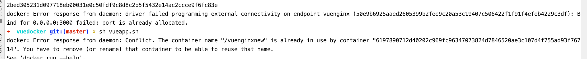

# 项目描述：
https://docs.docker.com/engine/reference/commandline/docker/

https://juejin.im/post/5cce4b1cf265da0373719819

* 1.docker image ls 

* 2.docker ps 


* 3.docker pull nginx

* 4.docker login 

* 5.docker -v

* 6.docker build -t nodewebserver .

* 7.docker image ls // 所有镜像

* 8.docker image ls | grep vuenginxcontainer // 只查找vuenginxcontainer镜像

* 9.docker exec -it ca739a6f2b36 bash

* 10.docker inspect 3909e330945c

* 11.netstat -ntpl | grep 3000

* 12.docker container ls

* 13.docker rm -f <container-name> // docker rm -f vueApp / id


https://hub.docker.com/

http://www.cnblogs.com/jaxer/p/7742186.html


1.此命令需要在Dockerfile文件同级目录下执行，就是vuedocker跟目录下；
```
docker build -t vuenginxcontainer .
```


```node
pwd
/Users/truexin/truexin/frontend-daily-learning/docker/vuedocker
```

```
docker run \
-p 3000:80 \
-d --name vuenginxnew \
--mount type=bind,source=/Users/truexin/truexin/frontend-daily-learning/docker/vuedocker/nginx,target=/etc/nginx/conf.d \
--mount type=bind,source=/Users/truexin/truexin/frontend-daily-learning/docker/vuedocker/dist,target=/usr/share/nginx/html \
nginx
```
命令太长，将此命令写进vueapp.sh
执行命令 sh vueapp.sh



* 1.nginx集群报错“upstream”directive is not allow here 错误？

http://www.zanghongtu.com/nginx%E9%9B%86%E7%BE%A4%E6%8A%A5%E9%94%99upstreamdirective-is-not-allow-here-%E9%94%99%E8%AF%AF/

* 2.nginx: [emerg] invalid URL prefix in URL/nginx.conf

https://blog.csdn.net/a515557595_xzb/article/details/78432504
