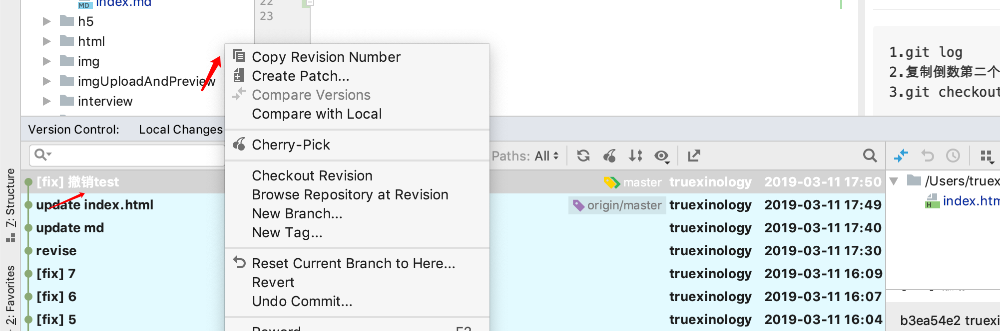

# git命令行操作：

```
git init
touch test.md
git add .
git commit -m 'fix: bug'
git push
```

```
git pull
```
## Q1: git log 模式如何退出？


```
1.英文状态下：按 q 就可以了；

2.同时按 ctrl + z；
```

## Q2: git commit -m ""内容写错，如何重新编辑?
```node
git commit --amend -m 'revise'
```
 
## Q3: git commit了多个文件，如何撤销某个提交的单个文件？
```node
1.git status 查看多个文件的具体名称
1.git log 查看commit的commitId[versionId]
2.复制倒数第二个commitId[versionId] : 如下：655af407806f35bfb8dca56774b831b7f9a9f7a4
3.git checkout <sha1-of-a-commit> </path/to/your/file>
例如：git checkout 655af407806f35bfb8dca56774b831b7f9a9f7a4 ./css/index.html
```
 或者 
 
 
 ## Q4:撤销本地所有修改？
 ```node
git checkout . && git clean -xdf
```

## Q5:git stash
- git 缓存 git stash 的用法？ 
`必须把修改的文件git add后才可以git stash`
```
（1）git stash save "save message" : 执行存储时，添加备注，方便查找，只有 git stash 也要可以的，但查找时不方便识别。

（2）git stash list ：查看 stash 了哪些存储，退出使用:1.ctrl+c / 2.ecs 后 :wq 与vim模式退出一样

（3）git stash show ：显示做了哪些改动，默认 show 第一个存储,如果要显示其他存贮，后面加 stash@{$num}，num从0开始，比如第二个 git stash show stash@{1}
    退出使用: ecs 后 :wq 与vim模式退出一样
（4）git stash show -p : 显示第一个存储的改动，如果想显示其他存存储，命令：git stash show stash@{$num} -p ，num从0开始，比如第二个：git stash show stash@{1} -p

（5）git stash apply :应用某个存储,但不会把存储从存储列表中删除，默认使用第一个存储,即 stash@{0}，num从0开始，如果要使用其他个，git stash apply stash@{$num} ， 比如第二个：git stash apply stash@{1}

（6）git stash pop ：命令恢复之前缓存的工作目录，将缓存堆栈中的对应 stash 删除，并将对应修改应用到当前的工作目录下,默认为第一个 stash,即 stash@{0}，如果要应用并删除其他 stash，命令：git stash pop stash@{$num} ，比如应用并删除第二个：git stash pop stash@{1}

（7）git stash drop stash@{$num} ：丢弃stash@{$num}存储，从列表中删除这个存储

（8）git stash clear ：删除所有缓存的 stash
```
