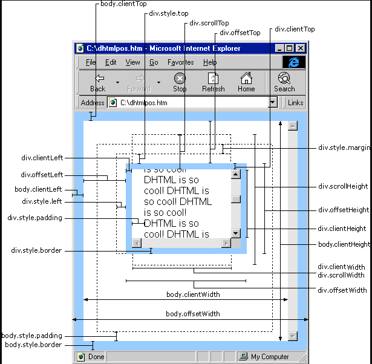
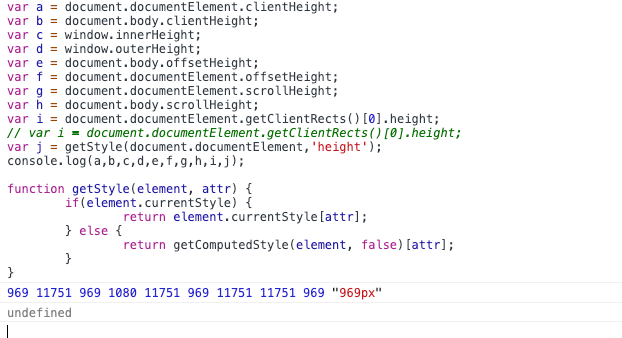
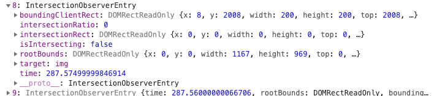

# 项目描述：
height：指元素内容的高度，jQuery中的height()方法返回的就是这个高度。
clientHeight：内容高度+padding高度，jQuery中的innerHeight()方法返回的就是这个高度。
offsetHeight：内容高度+padding高度+边框宽度，jQuery中的outerHeight()方法返回的就是这个高度。

width：指元素内容的宽度，jQuery中的width()方法返回的就是这个宽度。
clientWidth：内容高度+padding宽度，jQuery中的innerWidtht()方法返回的就是这个宽度。
offsetWidth：内容高度+padding高度+边框宽度，jQuery中的outerWidth()方法返回的就是这个宽度。



```

offsetWidth = width+padding+border
js：var offsetW = document.documentElement.offsetWidth || document.body.offsetWidth;//兼容浏览器

jq：$('body')[0].offsetWidth;

offsetHeight = height+padding+border
js：var offsetH = document.documentElement.offsetHeight || document.body.offsetHeight;//兼容浏览器

jq：$('body')[0].offsetHeight;


clientWidth = width+padding
js：var clientW = document.documentElement.clientWidth || document.body.clientWidth;//兼容浏览器

jq：$('body')[0].clientWidth;

clientHeight = height+padding
js：var clientH = document.documentElement.clientHeight || document.body.clientHeight;//兼容浏览器

jq：$('body')[0].clientHeight;


width() = width+padding //可视屏幕宽，不包括滚动条
$(window).width();

height() = height+padding// 可视屏幕高，不包括滚动条
$(window).height();


innerWidth() = width+padding+border+横向滚动条  //整个屏幕宽
$(window).innerWidth();

innerHeight() = height+padding+border+纵向滚动条  ///整个屏幕高
$(window).innerHeight();
```



var a = document.documentElement.clientHeight;
var b = document.body.clientHeight;
var c = window.innerHeight;
var d = window.outerHeight;
var e = document.body.offsetHeight;
var f = document.documentElement.offsetHeight;
var g = document.documentElement.scrollHeight;
var h = document.body.scrollHeight;
var hh = document.documentElement.scrollTop;
var i = document.documentElement.getClientRects()[0].height;
var ii = window.screen.height;
var jj = window.screen.availHeight;
var j = getStyle(document.documentElement,'height');
console.log(a,b,c,d,e,f,g,h,i,j,ii,jj,hh);

function getStyle(element, attr) {
        if(element.currentStyle) {
                return element.currentStyle[attr];
        } else {
                return getComputedStyle(element, false)[attr];
        }
}
// 969 7650 969 1080 7650 7708 7708 7700 7708 "7708px" 1080 1057 792

getBoundingClientRect


window对象：

（1）innerHeight属性：窗口中文档显示区域的高度，不包括菜单栏、工具栏等部分。该属性可读可写。

     IE不支持该属性，IE中body元素的clientHeight属性与该属性相同。

（2)innerWidth属性：窗口中文档显示区域的宽度，同样不包括边框。该属性可读可写。

     IE不支持该属性，IE中body元素的clientWidth属性与该属性相同。

     clientHeight与clientWidth属性是只读的。

     另外，IE不支持outerWidth、outerHeight属性。

 (3)pageXOffset属性：整数只读属性，表示文档向右滚动过的像素数。

     IE不支持该属性，使用body元素的scrollLeft属性替代。

 (4)pageYOffset属性：整数只读属性，表示文档向下滚动过的像素数。

     IE不支持该属性，使用body元素的scrollTop属性替代。

 兼容IE与DOM浏览器，如何获取窗口中文档显示区域的宽度及高度，使用?:条件语句，如下：

 windows.innerWidth ? windows.innerWidth : document.body.clientWidth;

 windows.innerHeight ? windows.innerHeight : document.body.clientHeight;


网页可见区域宽： document.body.clientWidth;
网页可见区域高： document.body.clientHeight;
网页可见区域宽： document.body.offsetWidth (包括边线的宽);
网页可见区域高： document.body.offsetHeight (包括边线的宽);
网页正文全文宽： document.body.scrollWidth;
网页正文全文高： document.body.scrollHeight;
网页被卷去的高： document.body.scrollTop;
网页被卷去的左： document.body.scrollLeft;
网页正文部分上： window.screenTop;
网页正文部分左： window.screenLeft;
屏幕分辨率的高： window.screen.height; //== outerHeight
屏幕分辨率的宽： window.screen.width;
屏幕可用工作区高度： window.screen.availHeight;
屏幕可用工作区宽度：window.screen.availWidth;

IntersectionObserver API 使用教程:

http://www.ruanyifeng.com/blog/2016/11/intersectionobserver_api.html


