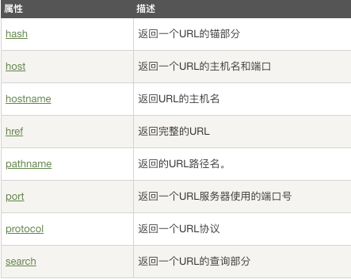
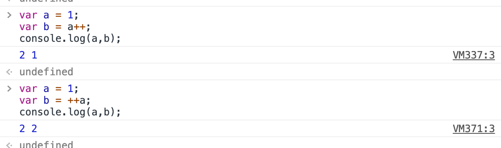
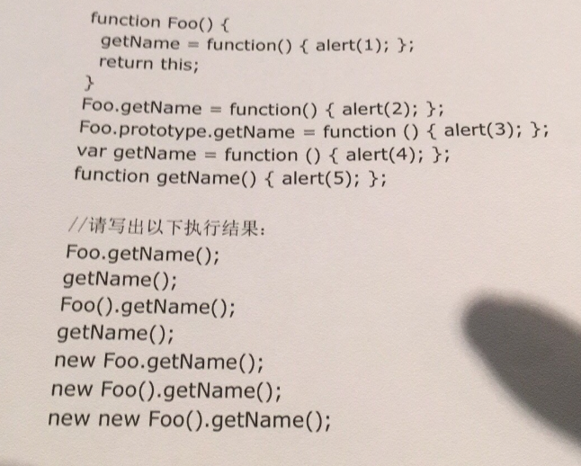
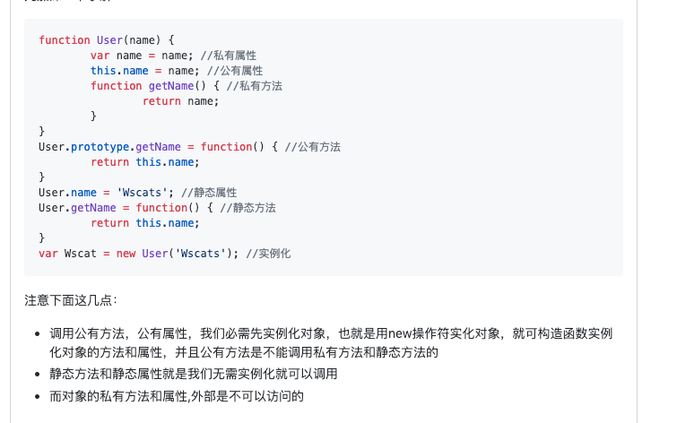

# 面试题：
## 1.form提交和ajax提交区别？
-

```text
在使用form表单的时候，一旦点击提交触发submit事件，
一般会使得页面跳转，页面间的跳转等行为的控制权往往在后端，
后端会控制页面的跳转及数据传递，
但是在某些时候不希望页面跳转，或者说想要将控制权放在前端，
通过js来操作页面的跳转或数据变化。
```
- 1.页面是否跳转；
- 2.form提交只需要在form上面设置action=【url】，
method=【get/post】
按钮[input/button]里面type=submit;提交后，
请求会自动获取表单input的值；
而ajax提交的url，method，data需要在ajax的请求中手动设置，并且需要一个点击方法onclick=submit()进行触发提交数据；
- 3.默认提交请求的contentType不一样：
form【application/x-www-form-urlencoded】
而ajax的是application/json;


https://blog.csdn.net/zoulonglong/article/details/80501029

## 2.mouseover 与 mouseenter 区别？对应是mouseout , mouseleave
https://blog.csdn.net/cao199408/article/details/70210826
```md
不论鼠标指针穿过被选元素或其子元素，都会触发 mouseover 事件。对应mouseout

只有在鼠标指针穿过被选元素时，才会触发 mouseenter 事件。对应mouseleave
```
https://codepen.io/truexin/pen/moMMor?editors=1011

https://codepen.io/truexin/pen/jJGwzE?editors=1011

## 3.高阶函数的使用；是方法还是组件？
--
高阶函数是一个函数，它接收函数作为参数或将函数作为输出返回
--
https://juejin.im/post/5b019b6bf265da0b95276368
```md
高阶函数：以函数作为参数的函数，结果return一个函数。 
高阶组件：以组件作为参数的组件，结果return一个组件。
```

## 4.redux框架是怎么跟react框架连接交互的？；

## 5.如何定义书写一个class

## 6.window.location有哪些属性和方法？
1）location对象属性：


返回一个 URL 的主要部分。
假设 URL: http://www.runoob.com:9001/test.html?name=alex&gender=male&age=26＃PART2;
http://localhost:63342/frontend-daily-learning/interview/location.html?name=alex&gender=male&age=26#part

1. hash // #part2

2. pathname // test.html

3. host // www.runoob.com

4. protocol // http

5. port // 9001 //默认是：80

6. search // ?name=alex&gender=male&age=26＃PART2;

7. hostname // www.runoob.com

8. href // 全URL


## 7.Dom存在ul>li*5,如何获取li的索引；

```js
// 1）
var lis = document.getElementsByTagName('li');
    Array.prototype.map.call(lis, (v, i) => {
        lis[i].onclick = () => {
            alert(i + 1);
        }
    })
```

## 8.闭包是什么，以及闭包的缺点？
闭包是将函数内部和函数外部连接起来的桥梁
闭包就是能够读取其他函数内部变量的函数。
1）由于闭包会使得函数中的变量都被保存在内存中，内存消耗很大，
所以不能滥用闭包，否则会造成网页的性能问题，在IE中可能导致内存泄露。解决方法是，在退出函数之前，将不使用的局部变量全部删除。

2）闭包会在父函数外部，改变父函数内部变量的值。
所以，如果你把父函数当作对象（object）使用，把闭包当作它的公用方法（Public Method），把内部变量当作它的私有属性（private value），这时一定要小心，不要随便改变父函数内部变量的值。

## 9.解释下 JavaScript 中 this 是如何工作的？
调用一个函数会暂停当前函数的执行，传递控制权和参数给新函数。
除了声明时定义的形式参数，每个函数还接收两个附加的参数：this和arguments。
参数this在面向对象编程中非常重要，它的值取决于调用的模式。
在JavaScript中一个有4中调用模式：
方法调用模式、函数调用模式、构造器调用模式和apply调用模式。
这些模式在如何初始化关键参数this上存在差异。

## 10.使用canvas画出一个矩形？
```js
function draw(id){

      var canvas = document.getElementById(id);

      var context = canvas.getContext('2d');  //getContext() 方法可返回一个对象 // todo 目前唯一可取值

      context.strokeStyle = "pink";  //图形边框的填充颜色

      context.lineWidth = 5;  //用宽度为 5 像素的线条来绘制矩形：     

      context.strokeRect(50,50,180,120);  //绘制矩形（无填充）

      context.strokeRect(110,110,180,120);      

 }

 draw("canvas");


function draw(id){  

      var canvas = document.getElementById(id);  

      var context = canvas.getContext('2d');  //getContext() 方法可返回一个对象  

      context.fillStyle = "green";  // 设置或返回用于填充绘画的颜色、渐变或模式              

      context.fillRect(50,50,400,300);  // x轴 y轴 宽 和 高 ,绘制“被填充”的矩形      

 }  

 draw("canvas");  
```

## 11.node如何读写文件？
```node
fs.readFile()或fs.writeFile()
```
1）nodeJS中大文件读写操作--Stream流

fs.createReadStream()
fs.createWriteStream()

```js
var fs = require('fs');
var readLine = require('lei-stream').readLine;
 
// readLineStream第一个参数为ReadStream实例，也可以为文件名
var s = readLine(fs.createReadStream('./myfile.txt'), {
  // 换行符，默认\n
  newline: '\n',
  // 是否自动读取下一行，默认false
  autoNext: false,
  // 编码器，可以为函数或字符串（内置编码器：json，base64），默认null
  encoding: function (data) {
    return JSON.parse(data);
  }
});
 
// 读取到一行数据时触发data事件
s.on('data', function (data) {
  console.log(data);
  s.next();
});
 
// 流结束时触发end事件
s.on('end', function () {
  console.log('end');
});
```

** 按行写流 **
```js
var fs = require('fs');
var writeLineStream = require('lei-stream').writeLine;
 
// writeLineStream第一个参数为ReadStream实例，也可以为文件名
var s = writeLineStream(fs.createWriteStream('./myfile.txt'), {
  // 换行符，默认\n
  newline: '\n',
  // 编码器，可以为函数或字符串（内置编码器：json，base64），默认null
  encoding: function (data) {
    return JSON.stringify(data);
  },
  // 缓存的行数，默认为0（表示不缓存），此选项主要用于优化写文件性能，当数量缓存的内容超过该数量时再一次性写入到流中，可以提高写速度
  cacheLines: 0
});
 
// 写一行
s.write(data, function () {
  // 回调函数可选
  console.log('wrote');
});
 
// 结束
s.end(function () {
  // 回调函数可选
  console.log('end');
});
```

## 12.下面代码输出结果
```js
(function(){
    var a = b = 3;
})();
console.log(typeof a !== "undefined"); // false => a is not define.
console.log(typeof b !== "undefined"); // true => b = 3
```
实际：
```js
(function(){
    b = 3;  // 未使用var，全局变量，立即执行函数外面也可访问该变量b；
    var a = b; // a 不是全局变量，立即执行函数外面不可访问该变量a；
})();
```

## 13.++a 与 a++ 的区别；
++a返回新值；a++返回旧值；但是a都是增加的；
```js
var a = 2;
console.log(a++ + ++a + a++ + ++a)       //输出16
//新值       3      4     5     6
//计算       2  +   4  +  4  +  6   =  16            

```



## 14.ajax原理
```md
1) 创建xhr对象 
   //  IE7+, Firefox, Chrome, Opera, Safari 浏览器执行代码
   var xhr = new XMLHttpRequest();
   // IE6, IE5 浏览器执行代码
   var xhr = new ActiveXObject("Microsoft.XMLHTTP");
2）打开请求
   xhr.open("GET/POST", "info.txt", true); // open(method,url,async);
3) 发送请求
   xhr.send(); // send(string)
4) 接受响应
   xhr.onreadystatechange= function(){
        if(xhr.readyState == 4){
            if(xhr.status==200){
                 console.log(xhr.responseText);
            }
        } else { xhr.readyState = 1 / 2 / 3
           console.log(xhr.responseText);
        }
   }
```
```js
// todo synchronous // asynchronous 
const ajax = function(
    method = 'POST',
    url = '',
    data = {},
    async = true
    ) {
    let xmlHttp = null;
    if(window.XMLHttpRequest){ // IE7以上，其他流行浏览器执行代码；
        xmlHttp = new XMLHttpRequest();
    } else { // IE6 , IE5 浏览器执行代码
        xmlHttp = new ActiveXObject('Microsoft.XMLHTTP');
    }
    xmlHttp.open(method, url, async);
    xmlHttp.onreadystatechange = function(){ // onreadystatechange 全小写
        if(xmlHttp.readyState==4 && xmlHttp.status==200){ // readyState 单词边界大写
            console.log(xmlHttp.responseText);
        } else {
            console.log(xmlHttp.responseText);
        }
    }
    // xmlHttp.setRequestHeader("Content-type","application/x-www-form-urlencoded");
    xmlHttp.send();
}
```

# 优先级由高到低：小括号(xxx)  >  属性访问.   >  new foo()  >  foo()



## 15.定义一个new的方法；
```js
// 1.新建一个新的对象；
// 2.该对象的隐性原型链接到函数的原型；
// 3.调用函数绑定this；
// 4.返回这个新的对象。

const newCreate = function(func) {
    return function() {
        const newObj = {
            _proto_: func.prototype,
        };
        func.apply(newObj, arguments);
        return newObj;
    }
}

// demo1 
const Person = function(name) {
    this.name = name;
}

let personName = new Person('alex').name;
let personName2 = newCreate(Person)('tom').name;

console.log('personName',personName);
console.log('personName2',personName2);
console.log(personName == personName2);
```
