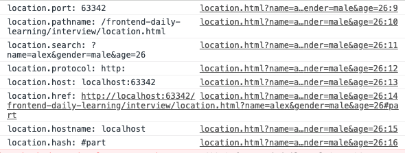

# 面试题：
https://www.zybuluo.com/mdeditor#1458375

https://www.jianshu.com/p/f1f39d5b2a2e?utm_campaign=maleskine&utm_content=note&utm_medium=seo_notes&utm_source=recommendation

https://juejin.im/post/5cb92d9a5188254160581b87

## 1.form提交和ajax提交区别？
-

```text
在使用form表单的时候，一旦点击提交触发submit事件，
一般会使得页面跳转，页面间的跳转等行为的控制权往往在后端，
后端会控制页面的跳转及数据传递，
但是在某些时候不希望页面跳转，或者说想要将控制权放在前端，
通过js来操作页面的跳转或数据变化。
```
- 1.页面是否跳转；
- 2.form提交只需要在form上面设置action=【url】，
method=【get/post】
按钮[input/button]里面type=submit;提交后，
请求会自动获取表单input的值；
而ajax提交的url，method，data需要在ajax的请求中手动设置，并且需要一个点击方法onclick=submit()进行触发提交数据；
- 3.默认提交请求的contentType不一样：
form【application/x-www-form-urlencoded】
而ajax的是application/json;


https://blog.csdn.net/zoulonglong/article/details/80501029

## 2.mouseover 与 mouseenter 区别？对应是mouseout , mouseleave
https://blog.csdn.net/cao199408/article/details/70210826
```md
不论鼠标指针穿过被选元素或其子元素，都会触发 mouseover 事件。对应mouseout

只有在鼠标指针穿过被选元素时，才会触发 mouseenter 事件。对应mouseleave
```
https://codepen.io/truexin/pen/moMMor?editors=1011

https://codepen.io/truexin/pen/jJGwzE?editors=1011

## 3.高阶函数的使用；是方法还是组件？
--
高阶函数是一个函数，它接收函数作为参数或将函数作为输出返回
--
https://juejin.im/post/5b019b6bf265da0b95276368
```md
高阶函数：以函数作为参数的函数，结果return一个函数。 
高阶组件：以组件作为参数的组件，结果return一个组件。
```

## 4.redux框架是怎么跟react框架连接交互的？；

## 5.如何定义书写一个class

## 6.window.location有哪些属性和方法？
1）location对象属性：


返回一个 URL 的主要部分。
假设 URL: http://www.runoob.com:9001/test.html?name=alex&gender=male&age=26＃PART2;
http://localhost:63342/frontend-daily-learning/interview/location.html?name=alex&gender=male&age=26#part

1. hash // #part2

2. pathname // test.html

3. host // www.runoob.com

4. protocol // http

5. port // 9001 //默认是：80

6. search // ?name=alex&gender=male&age=26＃PART2;

7. hostname // www.runoob.com

8. href // 全URL



## 7.Dom存在ul>li*5,如何获取li的索引；

```js
// 1）
var lis = document.getElementsByTagName('li');
    Array.prototype.map.call(lis, (v, i) => {
        lis[i].onclick = () => {
            alert(i + 1);
        }
    })
```

## 8.闭包是什么，以及闭包的缺点？
闭包是将函数内部和函数外部连接起来的桥梁
闭包就是能够读取其他函数内部变量的函数。
1）由于闭包会使得函数中的变量都被保存在内存中，内存消耗很大，
所以不能滥用闭包，否则会造成网页的性能问题，在IE中可能导致内存泄露。解决方法是，在退出函数之前，将不使用的局部变量全部删除。

2）闭包会在父函数外部，改变父函数内部变量的值。
所以，如果你把父函数当作对象（object）使用，把闭包当作它的公用方法（Public Method），把内部变量当作它的私有属性（private value），这时一定要小心，不要随便改变父函数内部变量的值。

## 9.解释下 JavaScript 中 this 是如何工作的？
调用一个函数会暂停当前函数的执行，传递控制权和参数给新函数。
除了声明时定义的形式参数，每个函数还接收两个附加的参数：this和arguments。
参数this在面向对象编程中非常重要，它的值取决于调用的模式。
在JavaScript中一个有4中调用模式：
方法调用模式、函数调用模式、构造器调用模式和apply调用模式。
这些模式在如何初始化关键参数this上存在差异。

## 10.使用canvas画出一个矩形？
```js
function draw(id){

      var canvas = document.getElementById(id);

      var context = canvas.getContext('2d');  //getContext() 方法可返回一个对象 // todo 目前唯一可取值

      context.strokeStyle = "pink";  //图形边框的填充颜色

      context.lineWidth = 5;  //用宽度为 5 像素的线条来绘制矩形：     

      context.strokeRect(50,50,180,120);  //绘制矩形（无填充）

      context.strokeRect(110,110,180,120);      

 }

 draw("canvas");


function draw(id){  

      var canvas = document.getElementById(id);  

      var context = canvas.getContext('2d');  //getContext() 方法可返回一个对象  

      context.fillStyle = "green";  // 设置或返回用于填充绘画的颜色、渐变或模式              

      context.fillRect(50,50,400,300);  // x轴 y轴 宽 和 高 ,绘制“被填充”的矩形      

 }  

 draw("canvas");  
```

## 11.node如何读写文件？
```node
fs.readFile()或fs.writeFile()
```
1）nodeJS中大文件读写操作--Stream流

fs.createReadStream()
fs.createWriteStream()

```js
var fs = require('fs');
var readLine = require('lei-stream').readLine;
 
// readLineStream第一个参数为ReadStream实例，也可以为文件名
var s = readLine(fs.createReadStream('./myfile.txt'), {
  // 换行符，默认\n
  newline: '\n',
  // 是否自动读取下一行，默认false
  autoNext: false,
  // 编码器，可以为函数或字符串（内置编码器：json，base64），默认null
  encoding: function (data) {
    return JSON.parse(data);
  }
});
 
// 读取到一行数据时触发data事件
s.on('data', function (data) {
  console.log(data);
  s.next();
});
 
// 流结束时触发end事件
s.on('end', function () {
  console.log('end');
});
```

** 按行写流 **
```js
var fs = require('fs');
var writeLineStream = require('lei-stream').writeLine;
 
// writeLineStream第一个参数为ReadStream实例，也可以为文件名
var s = writeLineStream(fs.createWriteStream('./myfile.txt'), {
  // 换行符，默认\n
  newline: '\n',
  // 编码器，可以为函数或字符串（内置编码器：json，base64），默认null
  encoding: function (data) {
    return JSON.stringify(data);
  },
  // 缓存的行数，默认为0（表示不缓存），此选项主要用于优化写文件性能，当数量缓存的内容超过该数量时再一次性写入到流中，可以提高写速度
  cacheLines: 0
});
 
// 写一行
s.write(data, function () {
  // 回调函数可选
  console.log('wrote');
});
 
// 结束
s.end(function () {
  // 回调函数可选
  console.log('end');
});
```

## 12.下面代码输出结果
```js
(function(){
    var a = b = 3;
})();
console.log(typeof a !== "undefined"); // false => a is not define.
console.log(typeof b !== "undefined"); // true => b = 3
```
实际：
```js
(function(){
    b = 3;  // 未使用var，全局变量，立即执行函数外面也可访问该变量b；
    var a = b; // a 不是全局变量，立即执行函数外面不可访问该变量a；
})();
```

## 13.++a 与 a++ 的区别；
++a返回新值；a++返回旧值；但是a都是增加的；
```js
var a = 2;
console.log(a++ + ++a + a++ + ++a)       //输出16
//新值       3      4     5     6
//计算       2  +   4  +  4  +  6   =  16            

```


## 14.ajax原理
```md
1) 创建xhr对象 
   //  IE7+, Firefox, Chrome, Opera, Safari 浏览器执行代码
   var xhr = new XMLHttpRequest();
   // IE6, IE5 浏览器执行代码
   var xhr = new ActiveXObject("Microsoft.XMLHTTP");
2）打开请求
   xhr.open("GET/POST", "info.txt", true); // open(method,url,async);
3) 发送请求
   xhr.send(); // send(string)
4) 接受响应
   xhr.onreadystatechange= function(){
        if(xhr.readyState == 4){
            if(xhr.status==200){
                 console.log(xhr.responseText);
            }
        } else { xhr.readyState = 1 / 2 / 3
           console.log(xhr.responseText);
        }
   }
```
```js
// todo synchronous // asynchronous 
const ajax = function(
    method = 'POST',
    url = '',
    data = {},
    async = true
    ) {
    let xmlHttp = null;
    if(window.XMLHttpRequest){ // IE7以上，其他流行浏览器执行代码；
        xmlHttp = new XMLHttpRequest();
    } else { // IE6 , IE5 浏览器执行代码
        xmlHttp = new ActiveXObject('Microsoft.XMLHTTP');
    }
    xmlHttp.open(method, url, async);
    xmlHttp.onreadystatechange = function(){ // onreadystatechange 全小写
        if(xmlHttp.readyState==4 && xmlHttp.status==200){ // readyState 单词边界大写
            console.log(xmlHttp.responseText);
        } else {
            console.log(xmlHttp.responseText);
        }
    }
    // xmlHttp.setRequestHeader("Content-type","application/x-www-form-urlencoded");
    xmlHttp.send();
}
```

# 优先级由高到低：小括号(xxx)  >  属性访问.   >  new foo()  >  foo()


## 15.定义一个new的方法；
```js
// 1.新建一个新的对象；
// 2.该对象的隐性原型链接到函数的原型；
// 3.调用函数绑定this；
// 4.返回这个新的对象。

const newCreate = function(func) {
    return function() {
        const newObj = {
            _proto_: func.prototype,
        };
        func.apply(newObj, arguments);
        return newObj;
    }
}

// demo1 
const Person = function(name) {
    this.name = name;
}

let personName = new Person('alex').name;
let personName2 = newCreate(Person)('tom').name;

console.log('personName',personName);
console.log('personName2',personName2);
console.log(personName == personName2);
```


# 2019面试题整理

标签（空格分隔）： js css html node webpack nginx

---
### 1. javascript的typeof返回哪些数据类型.
```
基础类型：string, number, boolean, symbol, undefined,
引用类型：object, function // 其中object包括Array,RegExp,Math,Date...
特殊基础类型：null; // 指向空指针 var str = null; typeof str === 'object' && str === null // true
```

### 2. 例举3种强制类型转换和2种隐式类型转换?
```
强制转换：String(),Number(),Boolean(),parseInt(),parseFloat()...
隐式转换：==,+,-,*,/,!!...
```

注意:
`
有两个奇葩需要注意:
undefined==null，虽然undefined转换成数字为NaN，null转换成数字为0，但是它们是相等的
空白字符串" "，要与空字符串区别开，空白字符串转换成数字为0，转换成布尔类型为true，但是" "==false，把==两端都转换成数字就好理解了 
虽然if语句和==会自动转换数据类型，但是写代码的时候要避免这种容易引起歧义的写法，判断相等尽量使用===
`
字符串类型转换成数字类型过程，先将字符串类型的值进行var str1 = str.trim();即前后空格去掉再调用var num = Number(str1)方法；//所以空白字符串‘ ’去掉前后空格就是空字符串‘’；
```
var a = ' ';
var b = false;
console.log(!!a,!!b,a==b); // true false true
```

### 3.IE和标准下有哪些兼容性的写法
http://www.fly63.com/article/detial/665
```
1. 取消冒泡和阻止浏览器的默认行为 ：
function stopBubble(e) { 
    //如果提供了事件对象，则这是一个非IE浏览器 
    if ( e && e.stopPropagation ) 
        //因此它支持W3C的stopPropagation()方法 
        e.stopPropagation(); 
    else 
        //否则，我们需要使用IE的方式来取消事件冒泡 
        window.event.cancelBubble = true; 
}
//阻止浏览器的默认行为 
function stopDefault( e ) { 
    //阻止默认浏览器动作(W3C) 
    if ( e && e.preventDefault ) 
        e.preventDefault(); 
    //IE中阻止函数器默认动作的方式 
    else 
        window.event.returnValue = false; 
    return false; 
}

2. 事件和目标元素：
var ev = ev || window.event；
Var target = ev.srcElement||ev.target
//获取事件对象的兼容性写法
 getEvent: function(event){
     return event ? event : window.event;
 },
 //获取事件对象目标的兼容性写法
 getTarget: function(event){
     return event.target || event.srcElement;
 }
3. 浏览器滚动距离以及浏览器可视窗口获取：
function getScrollTop(){     
    var scrollTop=0;     
    if(document.documentElement && document.documentElement.scrollTop){     
        scrollTop=document.documentElement.scrollTop;     
    }else if(document.body){     
        scrollTop=document.body.scrollTop;     
    }     
    return scrollTop;     
} 

document.documentElement.clientWidth || document.body.clientWidth；

4. css hack：
5. 盒子模型box-sizing:
6. 事件绑定和取消
//添加事件监听兼容函数  
function addHandler(target, eventType, handler){  
    if(target.addEventListener){//主流浏览器  
        addHandler = function(target, eventType, handler){  
            target.addEventListener(eventType, handler, false);  
        };  
    }else{//IE  
        addHandler = function(target, eventType, handler){  
            target.attachEvent("on"+eventType, handler);  
        };        
    }  
    //执行新的函数  
    addHandler(target, eventType, handler);  
}  
addHandler：function(element,type,handler){
    if(element.addEventListener){//检测是否为DOM2级方法
        element.addEventListener(type, handler, false);
    }else if (element.attachEvent){//检测是否为IE级方法
        element.attachEvent("on" + type, handler);
    } else {//检测是否为DOM0级方法
        element["on" + type] = handler;
    }
}
//删除事件监听兼容函数  
function removeHandler(target, eventType, handler){  
    if(target.removeEventListener){//主流浏览器  
        removeHandler = function(target, eventType, handler){  
            target.removeEventListener(eventType, handler, false);  
        }         
    }else{//IE  
        removeHandler = function(target, eventType, handler){  
            target.detachEvent("on"+eventType, handler);  
        }         
    }  
    //执行新的函数  
    removeHandler(target, eventType, handler);  
}  
removeHandler：function(element, type, handler){
       if (element.removeEventListener){
           element.removeEventListener(type, handler, false);
       } else if (element.detachEvent){
           element.detachEvent("on" + type, handler);
       } else {
           element["on" + type] = null;
       }
}

```

### 4.手写document.getElementsByClassName()
```
1.
/MSIE\s*(\d+)/i.test(navigator.userAgent);
var isIE=parseInt(RegExp.$1?RegExp.$1:0);
if(isIE>0&&isIE<9){
    document.getElementsByClassName=function(cls){
        var els=this.getElementsByTagName('*');
        var ell=els.length;
        var elements=[];
        for(var n=0;n<ell;n++){
            var oCls=els[n].className||'';
            if(oCls.indexOf(cls)<0)        continue;
            oCls=oCls.split(/\s+/);
            var oCll=oCls.length;
            for(var j=0;j<oCll;j++){
                if(cls==oCls[j]){
                    elements.push(els[n]);
                    break;
                }
            }
        }
        return elements;
    }
}
2.
function getByClassName(obj,cls){//obj目标元素，cls要获得的class名
    var element = obj.getElementsByTagName('*');//将目标下的所有子元素获取到
    var result = []; //定义一个数组，存放获得的classname = "cls" 的所有值
    for(var i = 0; i< element.length; i++){
        if(element[i].className == cls){
            result.push(element[i]);
        }
    }
    return result;
}
```

### 请写出隐藏一个html元素的各种方式？
```md
input type = 'hidden' {脱离文档流，不可绑定事件}
div hidden
div display = 'none'
div visibility = 'hidden'
div opacity = 0
div position = 'absolute' , left = '-100000px'
```

### 已知年月，求该月共多少天？
* new Date() 日期格式处理:
https://blog.csdn.net/qq_39759115/article/details/78893853

```js
function getMonthLength(date) {
    let d = new Date(date);
    // 将日期设置为下月一号
    d.setMonth(d.getMonth()+1);
    d.setDate('1');
    // 获取本月最后一天
    d.setDate(d.getDate()-1);
    return d.getDate();
}
getMonthLength('2019-04-18');
new Date(2009,1,1);      //错误 Sun Feb 01 2009 00:00:00 GMT+0800 (中国标准时间)
new Date(2009,0,1);      //正确 Sun Jan 04 2009 00:00:00 GMT+0800 (中国标准时间)
new Date("2009/1/1");    //正确  
new Date("2009-1-1");    //正确  
new Date("2009.1.1");    //正确  
new Date("2009 1 1");    //正确  
new Date().getMonth();   //正确  //获取当前月份(0-11,0代表1月)   
new Date.getMonth();     //错误❎ 点操作符优先；
(new Date).getMonth();   //正确     
// 获取当前月份是new Date().getMonth()+1;   

function getDate(year,month) {
    return new Date(year, month + 1 , 0).getDate();  
    // todo
    //  date的值域在1～31之间；  
    //  但是：使用 new Date() 创建时间对象时，如果 date 传入 0，
    //  就能直接通过 getDate() 获取到最后一天的日期                                                  
}
getDate(2019,4)
```

### 已经知道秒数，请写出转换为时分秒的函数；
```js
function getTime (num) {
	const hours = Math.floor(num / 3600)
    const minutes = Math.floor(num % 60 / 60)
    const seconds = Math.floor(num % 60)
    return `${String(hours).padStart(2, '0')}:${String(minutes).padStart(2, '0')}:${String(seconds).padStart(2, '0')}`
}
function getTime(seconds) {
  return [seconds / 3600, seconds % 60 / 60, seconds % 60].map(v => {
    return `${Math.floor(v).toString().padStart(2, '0')}`
  }).join(':')
}
```

### 请用js计算1-10000中出现的0 的次数
```js
// todo "_"(下划线)，可以简单理解为赋值但以后不再使用,
//  一般来说加下划线的变量为私有变量，这是大家都比较遵守的一种代码规范吧
//  例如变量命名前面加个下划线表示私有。
//  使用下划线作为命名的意义一般是，这个变量是调用需要的，
//  但是我并不想使用，也懒得起名字了，避免制造信息噪音

function getZeroCount(num){
    return new Array(num)
        .fill('') // ['',...,''] 10000个空字符串的数组
        .map((_,index) => index + 1) // [1,...,10000] 1-10000数字字符串的数组, _表示占位符号，不需要使用；
        .filter(item => /0/.test(item)) // 所有包含0数字的字符串的数组组合
        .reduce( // 包含0数字的字符串里面可能还有0，所以需要全部计算起来
            (count, item) => { 
                return count + (String(item).match(/0/g) || []).length 
                // str.match匹配不到会返回null；
            }
            ,
            0 // 初始值为0
        )
}

function getZeroCount(num) {
    return Array.from({length: num}, (v, i) => i + 1) // [1,...,10000] 1-10000数字字符串的数组,
    .join() // [1,...,10000] 1-10000数字字符串拼接的长字符串,
    .split("0") // 分隔符，一个分隔符将字符串分成两段；刚好比段数少1；
    .length - 1; //一个分隔符将字符串分成两段；刚好比段数少1；
}

console.log(getZeroCount(10000));
```

### 将url的查询参数解析成字典对象
```js
function getQueryObject(url) {
    url = url == null ? window.location.href : url;
    let search = url.substring(url.lastIndexOf("?") + 1);
    let obj = {};
    let reg = /([^?&=]+)=([^?&=]*)/g;
    search.replace(reg, function (rs, $1, $2) {
        let name = decodeURIComponent($1);
        let val = decodeURIComponent($2);                
        val = String(val);
        obj[name] = val;
        return rs;
    });
    return obj;
}
getQueryObject();

/**
 * 解析url参数
 * @search ?id=12345&a=b
 * @return Object {id:12345, a:b}
 * */
function urlParse(search) {
  let url = search || window.location.search;
  let obj = {};
  let reg = /[^?&]+=[^?&]*/g;
  let arr = url.match(reg);
  if (arr) {
    arr.forEach(item => {
      let tempArr = item.split('=');
      let key = decodeURIComponent(tempArr[0]);
      let val = decodeURIComponent(tempArr[1]);
      obj[key] = val;
    })
  }
  return obj;
}
```

### 判断一个字符串中出现次数最多的字符，统计这个次数
https://www.jianshu.com/p/85afc31175d9


学习：
var str = 'qweqrtyuiqqqwrtyudfgerqtywer';

1.str.charAt(5) == str[5];
2.var obj = {};
var json = str.split('').reduce((m, n) => (m[n]++ || (m[n] = 1), m), {});
3.var obj = {};
str.replace(
    /(\w{1})/g,
    function($1){ //1.()=>$1,一个括号匹配一个$ 2.匹配到多少次就执行多少次callback
       ++obj[$1] || obj[$1] = 1;
    }
)
4.使用打擂算法统计需要的值
var name = '';
var num = 0;
for(var key in obj){
   if(obj[key]>num){
       num = obj[key];
       name = key;
   }
}
return {
    name,
    num
}


例子：
String.prototype.trim = function(){
  /**
   * @param rs：匹配结果
   * @param $1:第1个()提取结果
   * @param $2:第2个()提取结果
   * @param offset:匹配开始位置
   * @param source：原始字符串
   */
  this.replace(/(^\s+)|(\s+$)/g,function(rs,$1,$2,offset,source){
    //arguments中的每个元素对应一个参数
    console.log(arguments,$1,$2);
  });
};
" abcd ".trim();
//输出结果：[" ", " ", undefined, 0, " abcd "] //第1次匹配结果
//[" ", undefined, " ", 5, " abcd "] //第2次匹配结果

```js
var str = 'abcdefgaddda';
var arr = str.split('');   //将字符串转为数组
var newArr = [];      //声明一个数组保存去重后的字符
var numArr = [];      //声明一个数组保存字符对应的个数
arr.forEach(function(element,index,array){
    var index1 = newArr.indexOf(element);    //获取当前元素在去重数组中的索引,如果存在则大于等于0,不存在则为-1
    if(index1==-1){
        newArr.push(element);   //判断去重数组里没有当前元素,所以往数组里面追加
        numArr.push(1);          //同步更新个数组对应的字符个数,刚追加进去都为1
    }else{
        numArr[index1]++;        //如果当前元素已存在,则更新个数数组对应的字符个数自增1
    }
})
console.log(arr,newArr,numArr);
//["a", "b", "c", "d", "e", "f", "g", "a", "d", "d", "d", "a"] 原字符数组
//["a", "b", "c", "d", "e", "f", "g"]  去重后的字符的数组
//[3, 1, 1, 4, 1, 1, 1]   去重后的字符数组对应的个数数组

//得到去重后的字符数组及对应的字符个数后,找个数最大的数及对应的字符
function sortNumber(a,b){
    return b-a;   //规定排序规则
}
var numArr1 = [].concat(numArr);   
//创建一个新数组并连接原数组,这样改变原数组才不会影响复制后的数组
numArr1.sort(sortNumber);  //将每个字符的个数从大到小排序
var maxNum = numArr1[0];   //获取最大个数
var index = numArr.indexOf(maxNum);   //最大个数对应原数组的位置
var maxStr = newArr[index];           //根据最大个数的位置找到出现次数最多的字符
console.log('字符串"'+str+'",'+maxStr+'出现次数最多,次数为'+maxNum);
```

### 求一个字符串的字节长度
```js
//假设一个中文占两个字节
var str = '22两是';
console.log(getStrLen(str));

function getStrLen(str){
    var json = {
        len: 0
    }
    var re = /[\u4e00-\u9fa5]/; // todo 1
    for (var i = 0; i < str.length; i++) {
        if(re.test(str.charAt(i))){
            //方法 charCodeAt() 与 charAt() 方法执行的操作相似，
            // 只不过前者返回的是位于指定位置的字符的编码，而后者返回的是字符子串。
            json['len']++;
        }
    }
    return json['len'] + str.length;
}

function GetBytes(str){     
    var len = str.length;        
    var bytes = len;        
    for(var i=0; i<len; i++){
        if (str.charCodeAt(i) > 255) { // todo 2
            //遍历判断字符串中每个字符的Unicode码,大于255则为中文
            //注释：字符串中第一个字符的下标是 0。
            // 如果 index 是负数，或大于等于字符串的长度，则 charCodeAt() 返回 NaN。
            bytes++;    
        }
    }       
    return bytes;  
}


```
