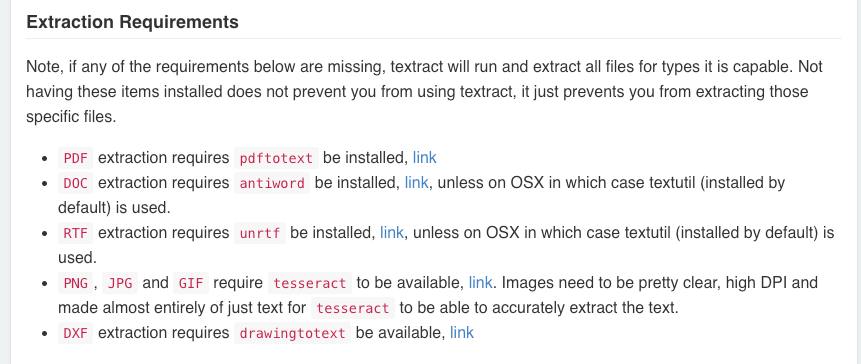

# 安装依赖
  ```
  $ npm i
  ```

# 启动服务
  ```
  $ npm start
  ```
# api说明:
  1、上传图片接口: http://localhost:3000/upload_image
  2、下载图片接口: http://localhost:3000/download_image
  3、上传excel接口: http://localhost:3000/upload_excel
  
  //想获得命令行后面的几个参数值
  /*
  //node arg.js arg1 arg2 arg3， 想取得这三个参数
  //即可以程序中用：
  var args = process.argv.splice(2)
  //process是一个全局对象，argv返回的是一组包含命令行参数的数组。
  //第一项为”node”，第二项为执行的js的完整路径，后面是附加在命令行后的参数
  */
  
  
  ```js
app.get('/', (req, res) => {
    // todo
    // 直接生成html
    // res.writeHead(200, { 'content-type': 'text/html' });
    // res.end(
    //     '<form action="/upload" enctype="multipart/form-data" method="post">' +
    //     '<input type="text" name="reg1"><br>' +
    //     '<input type="text" name="reg2"><br>' +
    //     '<input type="file" name="upload" multiple="multiple"><br>' +
    //     '<input type="submit" value="Upload">' +
    //     '</form>'
    // );

    // todo
    // 直接使用本地的html，必须使用绝对路径；
    res.sendFile(__dirname + '/index.html');
});

```


