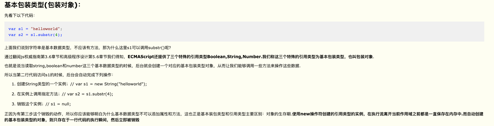
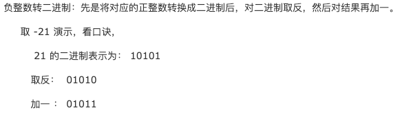
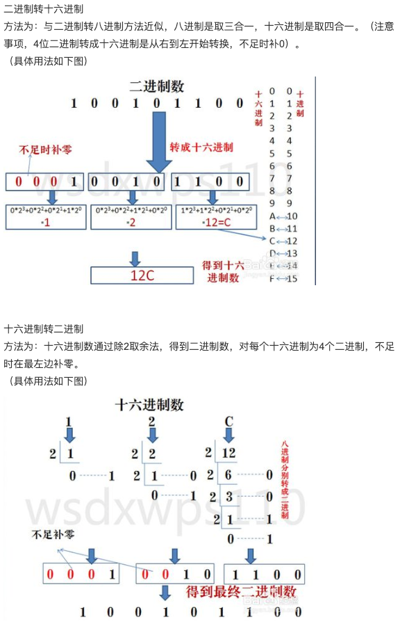

# JavaScript中如何检测一个变量是一个String类型？请写出函数实现

```node
var Str = function(){
this.name = 'alex';
};
var obj = new Str();
console.log(typeof(obj) === 'object'); // true
console.log(typeof Str); // 'function'
console.log(obj instanceof Str); 
console.log(obj.constructor === Str); // true
console.log(Object.prototype.toString.call(obj)); // '[object Object]'

1. typeof(str) === 'string'; typeof str === 'string';
3. obj instanceof Str; // true;
3. obj.constructor === Str; //true;
4. Object.prototype.toString.call(obj) === '[object Object]'; 
```


基本数据类型：Number、String、Boolean、Null、 Undefined、Symbol（ES6），这些类型可以直接操作保存在变量中的实际值。

引用数据类型：Object（在JS中除了基本数据类型以外的都是对象，数据是对象，函数是对象，正则表达式是对象）

https://www.cnblogs.com/c2016c/articles/9328725.html

### 1.arguments.callee
https://www.jianshu.com/p/72a590f59f4f
https://blog.csdn.net/u012863664/article/details/54743835
作用一. 取消代码与函数名的耦合状态
作用二. 取消匿名函数的绑定

### 2.closure
http://www.cnblogs.com/isaboy/p/javascript_closure.html
```markdown
A closure is an inner function that has access to the outer (enclosing) function's variables—scope chain.
闭包就是一个内部函数，它具备访问外部函数变量（这些变量位于作用域链中）的能力[注意变量不包含this和arguments]
```

### 3.函数柯理化
https://www.jianshu.com/p/f88a5175e7a2

```js
//  通用的函数柯里化构造方法
function curry(func){
    //新建args保存参数，注意，第一个参数应该是要柯里化的函数，所以args里面去掉第一个
    var args = [].slice.call(arguments,1);
    //新建_func函数作为返回值
    var _func =  function(){
        //参数长度为0，执行func函数，完成该函数的功能
        if(arguments.length === 0){
            return func.apply(this,args);
        }else {
            //否则，存储参数到闭包中，返回本函数
            [].push.apply(args,arguments);
            return _func;
        }
    }
    return _func;
}

function add(){
    return [].reduce.call(arguments,function(a,b){return a+b});
}
console.log(curry(add,1,2,3)(1)(2)(3,4,5,5)(5,6,6,7,8,8)(1)(1)(1)());//69
```

```js
function curry(func){
    //新建args保存参数，注意，第一个参数应该是要柯里化的函数，所以args里面去掉第一个
    var args = [].slice.call(arguments,1); //todo 1. args = [1,2,3];
    // var args = [].slice.apply(arguments,[1]); //todo 1. args = [1,2,3];
    //新建_func函数作为返回值
    var _func =  function(){
        //参数长度为0，执行func函数，完成该函数的功能
        if(arguments.length === 0){ //todo 2. arguments.length = 0
            //func(...args);
            return func.apply(this,args);
        }else { //todo 22. arguments.length = 1
            //否则，存储参数到闭包中，返回本函数
            //args.push(arguments);
            [].push.apply(args, arguments);
            return _func;
        }
    }
    return _func;
}

function add(){
    //todo 3. var arguments = [1,2,3];
    //todo 4. var result = arguments.reduce(function(a,b){return a+b});
    //todo 5. return result;
    return [].reduce.call(arguments,function(a,b){return a+b});
}
console.log(curry(add,1,2,3)());//6 
console.log(curry(add,1,2,3)(1)());//7
```
```js
const curry = (fn) => {
    if(fn.length <= 1){
        return fn;
    }
    const generator = (args) => (
        args.length === fn.length?
        fn(...args) : 
        arg => generator([...args, arg])
    );
    return generator;
}
```

```js
function curry(){
    var args = [].slice.call(arguments); // outerFn's arguments 类数组变成数组
    console.log('1',args);
    var fn =  function(){
        if(arguments.length === 0){ // innerFn's arguments
            var sum = 0;
            console.log('3',args);
            for(var i = 0; i < args.length; i++){
                sum += args[i];
            }
            return sum;
        }else {
            var args2 = [].slice.call(arguments); // 类数组变成数组
            console.log('2',args2);
            
            // es6
            //args = [...args, ...args2]; 
            
            // es5 //concat不修改原数组，需要赋值给原数组；
            args = args.concat(args2); 
            return fn;
        }
    }
    return fn;
}
console.log(curry(1,2,3)(1)(2)(3,4,5,5)(5,6,6,7,8,8)(1)(1)(1)());//69
console.log(curry(1)(1,2,3)());//7
```


### 4.prototype和__proto__与class的概念，JavaScript原型，原型链 ? 有什么特点？
https://www.cnblogs.com/chunlei36/p/6641021.html
prototype是函数的内置属性，__proto__是对象的内置属性


## 5.js如何生成唯一标识符UUID?
https://blog.csdn.net/likeuzi/article/details/70752623

UUID 是 通用唯一识别码（Universally Unique Identifier）的缩写
全局唯一标识符（GUID，Globally Unique Identifier）
也称作 UUID(Universally Unique IDentifier) 。

UUID是由一组32个16进制数字所构成，因此UUID理论上的总数为：3.4*10^38，
也就是说若每纳秒产生1兆个uuid，需要花100亿年才能用完所有的uuid，
所以它是唯一的，不必担心重复。 

GUID是一种由算法生成的二进制长度为128位的数字标识符。
GUID 的格式为“xxxxxxxx-xxxx-xxxx-xxxx-xxxxxxxxxxxx”，
其中的 x 是 0-9 或 a-f 范围内的一个32位十六进制数。
在理想情况下，任何计算机和计算机集群都不会生成两个相同的GUID。

GUID 的总数达到了2^128（3.4×10^38）个，
所以随机生成两个相同GUID的可能性非常小，但并不为0。
GUID一词有时也专指微软对UUID标准的实现。

===》0x表示十六进制， 0b表示二进制，0表示八进制。

https://jingyan.baidu.com/article/495ba84109665338b30ede98.html

a=0x12;//其实a=18
a=0b11;//其实a=3
a=012;//其实a=10

进制转换公式：
例如：
二进制的两个数；
a=1000, b=1010

---

二进制转十进制：

a = 1*2^3 + 0*2^2 + 0*2^1 + 0*2^0 = 8 + 0 + 0 + 0 = 8;
b = 1*2^3 + 0*2^2 + 1*2^1 + 0*2^0 = 8 + 0 + 2 + 0 = 10;

a = 8 % 2(0) = 4 % 2(0) = 2 % 2(0) = 1 % 0(1) = 1000; 
b = 10 % 2(0) = 5 % 2(1) = 2 % 2(0) = 1 % 0(1) = 1010; 




---

二进制转八进制：
方法为：3位二进制数按权展开相加得到1位八进制数。
（注意事项，3位二进制转成八进制是从右到左开始转换，不足时补0）。

a = 1000 = 001，000 = 0*2^2 + 0*2^1 + 1*2^0 , 0*2^2 + 0*2^1 + 0*2^0 = 1 , 0 = 10；
b = 1010 = 001，010 = 0*2^2 + 0*2^1 + 1*2^0 , 0*2^2 + 1*2^1 + 0*2^0 = 1 , 2 = 12；

a = 1 % 2(1), 0 % 2(0) = 1, 0 = 001, 000 = 001000 = 1000;
b = 1 % 2(1), (2 % 2(0) = 1 % 2(1)) = 1, 10 = 001, 010 = 001010 = 1010;


---

二进制转十六进制：
方法为：与二进制转八进制方法近似，八进制是取三合一，十六进制是取四合一。
（注意事项，4位二进制转成十六进制是从右到左开始转换，不足时补0）

a = 1000 = 1*2^3 + 0*2^2 + 0*2^1 + 0*2^0 = 1 = 8；
b = 1010 = 1*2^3 + 0*2^2 + 1*2^1 + 0*2^0 = 8 + 2 = 9；

a = 8 % 2(0) = 4 % 2(0) = 2 % 2(0) = 1 % 2(1) = 1000;
b = (10 % 2(0) = 5 % 2(1) = 2 % 2(0) = 1 % 2(1)) = 1010;




```js

// JS生成UUID
//此函数生成36位UUID样式为af333322-3fa8-4028-8dea-30a2abc2224
function getUUID() {
    return 'xxxx-xxxx-4xxx-yxxx-xxxxxxxxxxxx'.replace(
        /[xy]/g, 
        function(c) {
        // var r = Math.random() * 16 | 0;//这里其实还有一个作用就是把r变成了整数
        var r = Math.floor(Math.random() * 16);//这里其实还有一个作用就是把r变成了整数
        // var v = c == 'x' ? r : (r & 0x3 | 0x8); // 难以理解就直接替换了；
        var v = c == 'x' ? 
        r : 
        [8,9,10,11][Math.floor(Math.random()*4)];
        
        // 其实就是说x直接替换，y另外的用经过特殊处理的，
        // 这里的特殊处理就是 r&0x3|0x8 ,因为位运算有顺序，& > | ,把一个数的倒数4位 到 倒数8位取出来
        // 这样的值就限定在一个范围了，其范围就是二进制 1000-1011这样4个数字了，
        // 然后输出为8,9,A,B这样4个字符了。
        
        return v.toString(16);
    });
}

function get_uuid(){
    var s = [];
    var hexDigits = "0123456789abcdef";
    for (var i = 0; i < 36; i++) {
        s[i] = hexDigits.substr(Math.floor(Math.random() * 0x10), 1);
    }
    s[14] = "4";   // 0x10 = 1*16^1+0*16^0 = 16+0 = 16 : 0xA 或者(0xa) = 10
    s[19] = hexDigits.substr((s[19] & 0x3) | 0x8, 1); 
    s[8] = s[13] = s[18] = s[23] = "-";

    var uuid = s.join("");
    return uuid;
}
```

## 6.get与post区别？
1.Get产生一个TCP数据包；Post产生两个TCP数据包。
：对于GET方式的请求，浏览器会把http header和data一并发送出去，服务器响应200（返回数据）；
  对于POST，浏览器先发送header，服务器响应100（continue），
  然后再发送data，服务器响应200（返回数据）
2.GET幂等，POST不幂等：幂等是指同一个请求方法执行多次和仅执行一次的效果完全相同。
3.
GET后退按钮/刷新无害，POST数据会被重新提交（浏览器应该告知用户数据会被重新提交）。
GET书签可收藏，POST为书签不可收藏。
GET能被缓存，POST不能缓存 。
GET编码类型application/x-www-form-url，
POST编码类型encodedapplication/x-www-form-urlencoded 
或 multipart/form-data。为二进制数据使用多重编码。
GET历史参数保留在浏览器历史中。POST参数不会保存在浏览器历史中。
GET对数据长度有限制，当发送数据时，GET 方法向 URL 添加数据；
URL 的长度是受限制的（URL 的最大长度是 2048 个字符）。POST无限制。
GET只允许 ASCII 字符。POST没有限制。也允许二进制数据。
与 POST 相比，GET 的安全性较差，因为所发送的数据是 URL 的一部分。
在发送密码或其他敏感信息时绝不要使用 GET ！POST 比 GET 更安全，
因为参数不会被保存在浏览器历史或 web 服务器日志中。
GET的数据在 URL 中对所有人都是可见的。POST的数据不会显示在 URL 中。

1.GET请求的数据会附在URL之后，以?分割URL和传输数据，参数之间以&相连，
POST把提交的数据则放置在是HTTP包的包体中。
2.GET的长度受限于url的长度，而url的长度限制是特定的浏览器和服务器设置的，
理论上GET的长度可以无限长。
3.POST是没有大小限制的，HTTP协议规范也没有进行大小限制，
起限制作用的是服务器的处理程序的处理能力
4.在ASP中，服务端获取GET请求参数用Request.QueryString，
获取POST请求参数用Request.Form。
5.POST的安全性要比GET的安全性高application json 与form表单的区别?
瀏覽器默認的提交方式就是表單。
首先，Content-Type 被指定为 application/x-www-form-urlencoded，
jQuery的Ajax请求默认方式，
其次，数据以键值对形式？key1=value1&key2=value2的方式发送到服务器

并不是所有浏览器都会在POST中发送两次包，Firefox就只发送一次。

post和get的选择？

私密性的信息请求使用post。

查询信息和可以想要通过url分享的信息使用get。
