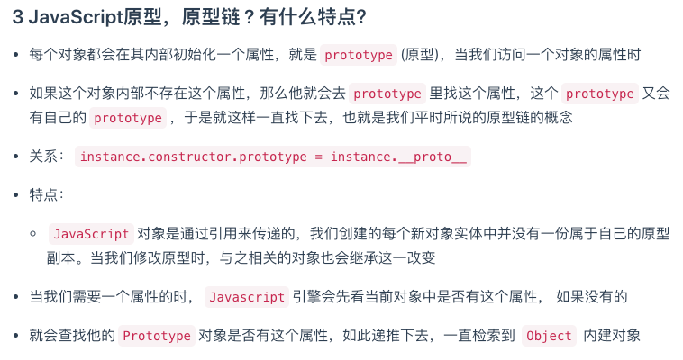

# JavaScript中如何检测一个变量是一个String类型？请写出函数实现

```node
var str = 'i am a string!';
1. typeof(str) === 'string'; //true;
2. typeof str === 'string'; //true;
3. str.constructor === String; //true;
```

### 1.arguments.callee
https://www.jianshu.com/p/72a590f59f4f
https://blog.csdn.net/u012863664/article/details/54743835
作用一. 取消代码与函数名的耦合状态
作用二. 取消匿名函数的绑定

### 2.closure
http://www.cnblogs.com/isaboy/p/javascript_closure.html
```markdown
A closure is an inner function that has access to the outer (enclosing) function's variables—scope chain.
闭包就是一个内部函数，它具备访问外部函数变量（这些变量位于作用域链中）的能力[注意变量不包含this和arguments]
```

### 3.函数柯理化
https://www.jianshu.com/p/f88a5175e7a2

```js
//  通用的函数柯里化构造方法
function curry(func){
    //新建args保存参数，注意，第一个参数应该是要柯里化的函数，所以args里面去掉第一个
    var args = [].slice.call(arguments,1);
    //新建_func函数作为返回值
    var _func =  function(){
        //参数长度为0，执行func函数，完成该函数的功能
        if(arguments.length === 0){
            return func.apply(this,args);
        }else {
            //否则，存储参数到闭包中，返回本函数
            [].push.apply(args,arguments);
            return _func;
        }
    }
    return _func;
}

function add(){
    return [].reduce.call(arguments,function(a,b){return a+b});
}
console.log(curry(add,1,2,3)(1)(2)(3,4,5,5)(5,6,6,7,8,8)(1)(1)(1)());//69
```

```js
function curry(func){
    //新建args保存参数，注意，第一个参数应该是要柯里化的函数，所以args里面去掉第一个
    var args = [].slice.call(arguments,1); //todo 1. args = [1,2,3];
    // var args = [].slice.apply(arguments,[1]); //todo 1. args = [1,2,3];
    //新建_func函数作为返回值
    var _func =  function(){
        //参数长度为0，执行func函数，完成该函数的功能
        if(arguments.length === 0){ //todo 2. arguments.length = 0
            //func(...args);
            return func.apply(this,args);
        }else { //todo 22. arguments.length = 1
            //否则，存储参数到闭包中，返回本函数
            //args.push(arguments);
            [].push.apply(args, arguments);
            return _func;
        }
    }
    return _func;
}

function add(){
    //todo 3. var arguments = [1,2,3];
    //todo 4. var result = arguments.reduce(function(a,b){return a+b});
    //todo 5. return result;
    return [].reduce.call(arguments,function(a,b){return a+b});
}
console.log(curry(add,1,2,3)());//6 
console.log(curry(add,1,2,3)(1)());//7
```
```js
const curry = (fn) => {
    if(fn.length <= 1){
        return fn;
    }
    const generator = (args) => (
        args.length === fn.length?
        fn(...args) : 
        arg => generator([...args, arg])
    );
    return generator;
}
```

```js
function curry(){
    var args = [].slice.call(arguments); // outerFn's arguments 类数组变成数组
    console.log('1',args);
    var fn =  function(){
        if(arguments.length === 0){ // innerFn's arguments
            var sum = 0;
            console.log('3',args);
            for(var i = 0; i < args.length; i++){
                sum += args[i];
            }
            return sum;
        }else {
            var args2 = [].slice.call(arguments); // 类数组变成数组
            console.log('2',args2);
            
            // es6
            //args = [...args, ...args2]; 
            
            // es5 //concat不修改原数组，需要赋值给原数组；
            args = args.concat(args2); 
            return fn;
        }
    }
    return fn;
}
console.log(curry(1,2,3)(1)(2)(3,4,5,5)(5,6,6,7,8,8)(1)(1)(1)());//69
console.log(curry(1)(1,2,3)());//7
```


### 4.prototype和__proto__与class的概念，JavaScript原型，原型链 ? 有什么特点？
https://www.cnblogs.com/chunlei36/p/6641021.html
prototype是函数的内置属性，__proto__是对象的内置属性

