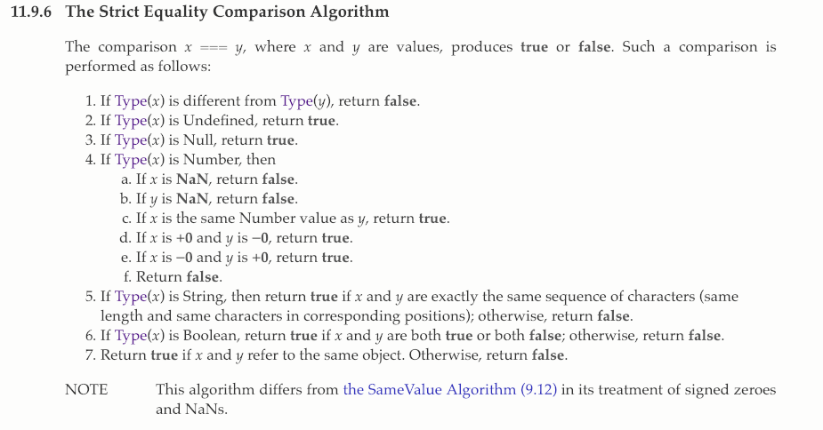
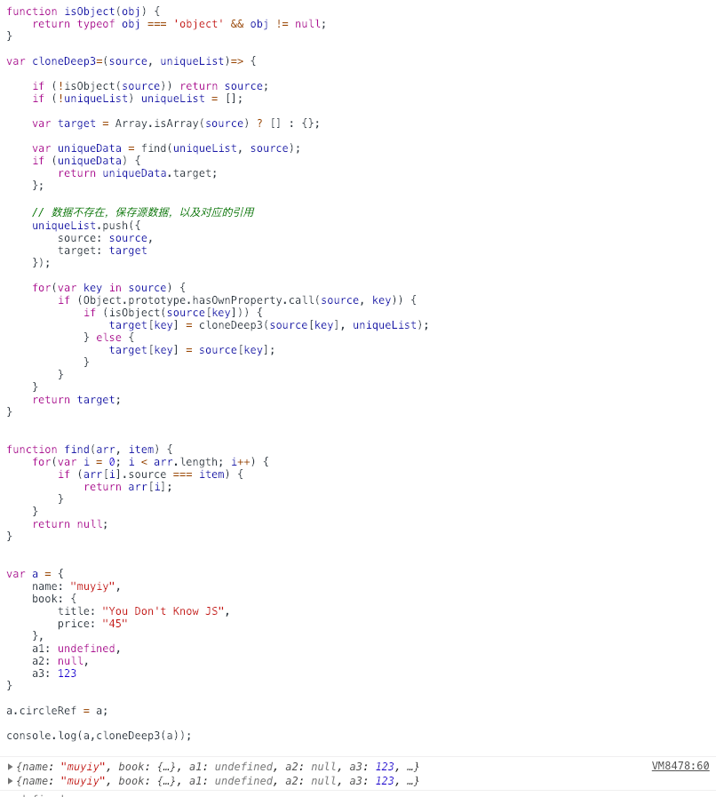
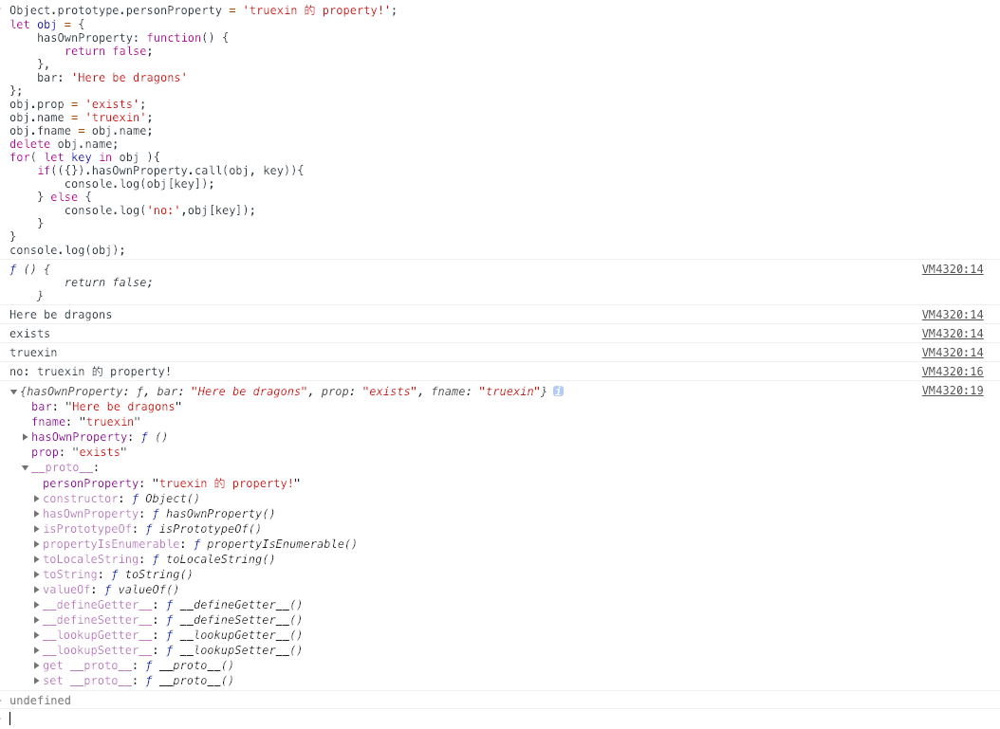
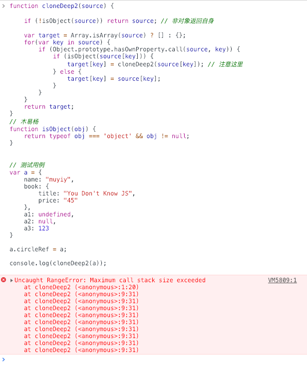

# 项目描述：
##1.数组打乱
https://blog.csdn.net/m0_38082783/article/details/79579116

## 2. 只有 NaN 跟自己不相等

console.log(NaN == NaN) // false; ===
console.log(null == null) // true; ===
console.log(undefined == undefined) // true; ===


## 3.parseInt
[1,2,3].map(parseInt);//[1,NaN,NaN];
实际：[1, 2, 3].map((num, index) => parseInt(num, index))

https://juejin.im/post/5c45112e6fb9a04a027aa8fe

```js

// 木易杨
function cloneDeep4(source, hash = new WeakMap()) {
    function isObject(obj) {
        return typeof obj === 'object' && obj != null;
    }
    if (!isObject(source)) return source; 
    if (hash.has(source)) return hash.get(source); 
      
    let target = Array.isArray(source) ? [...source] : { ...source }; // 改动 1
    hash.set(source, target);
    
    Reflect.ownKeys(target).forEach(key => { // 改动 2
        if (isObject(source[key])) {
            target[key] = cloneDeep4(source[key], hash); 
        } else {
            target[key] = source[key];
        }  
    });
    return target;
}

// 测试已通过

/*
* param obj
* name deepClone
* */
const deepClone = (source, uniqueList)=> {
    function find(arr, item) {
        for(let i = 0; i < arr.length; i++) {
            if (arr[i].source === item) {
                return arr[i];
            }
        }
        return null;
    }

    function isObject(obj) {
        return typeof obj === 'object' && obj != null;
    }

    if (!isObject(source)){
         return source;
    }
    
    if (!uniqueList){
        uniqueList = [];
    }
      
    let target = Array.isArray(source) ? [] : {};
    
    let uniqueData = find(uniqueList, source);
    if (uniqueData) {
        return uniqueData.target;
    };
        
    // 数据不存在，保存源数据，以及对应的引用
    uniqueList.push({
        source: source,
        target: target
    });

    for(let key in source) {
        if (Object.prototype.hasOwnProperty.call(source, key)) {
            if (isObject(source[key])) {
                target[key] = deepClone(source[key], uniqueList); 
            } else {
                target[key] = source[key];
            }
        }
    }
    return target;
}

```


注意1 -- 排除继承属性；
```js
Object.prototype.personProperty = 'truexin 的 property!';
let obj = {
    hasOwnProperty: function() {
        return false;
    },
    bar: 'Here be dragons'
};
obj.prop = 'exists';
obj.name = 'truexin';
obj.fname = obj.name;
delete obj.name;
for( let key in obj ){
    if(({}).hasOwnProperty.call(obj, key)){
        console.log(obj[key]);
    } else {
        console.log('no:',obj[key]);
    }
}
console.log(obj);
```


注意2 -- 防止循环堆栈溢出；


注意2 -- 解决引用丢失；
```js
var obj1 = {};
var obj2 = {a: obj1, b: obj1};

obj2.a === obj2.b; 
// true

var obj3 = cloneDeep2(obj2);
obj3.a === obj3.b; 
// false

```

