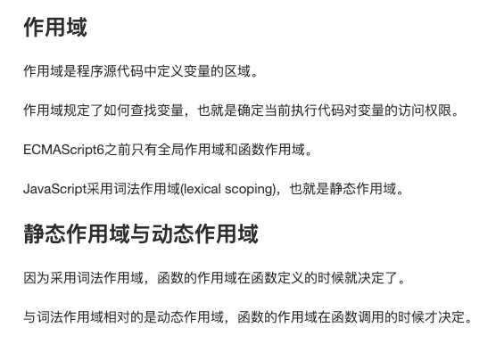
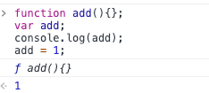

# 项目描述：
http://web.jobbole.com/91210/




* bash就是动态作用域
    ```bash
    bash ./scope.bash
    //2
    ```

* 这是因为在进入执行上下文时，首先会处理函数声明，
其次会处理变量声明，如果如果变量名称跟已经声明的形式参数或函数相同
，则变量声明不会干扰已经存在的这类属性。

```js
console.log(foo); // function foo(){console.log("foo")};

function foo(){
    console.log("foo");
}

var foo = 1;
```
