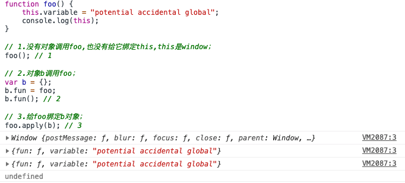

# js内存泄漏常见的四种情况

```js
function foo() {
    this.variable = "potential accidental global";
	console.log(this);
}

// 1.没有对象调用foo,也没有给它绑定this,this是window；
foo(); // 1

// 2.对象b调用foo；
var b = {};
b.fun = foo;
b.fun(); // 2

// 3.给foo绑定b对象；
foo.apply(b); // 3
```



https://segmentfault.com/a/1190000004896090
