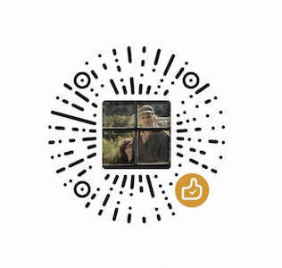

<div align="center">
  
  <h1>甜(Tu)言(Wei)蜜(Qing)语(Hua)</h1>
</div>

土味情话，在线生成：[https://works.yangerxiao.com/love-words/](https://works.yangerxiao.com/love-words/)

## 应用截图

### 首页


### 加载页


### 结果页


### 生成并下载的图片


### 生成适合分享出去的二维码


## 贡献土味情话

所有情话均存储在`src/assets/words.json`文件内，请 clone 代码然后提 PR。

P.S. `|`代表换行

## 本地开发

`git clone https://github.com/zerosoul/love-words.git`

`cd love-words && yarn install`

`yarn start`

Let's rock it~

## 支持



https://codepen.io/truexin/pen/jObaqZg

## 问题1
```
html2canvas 在 ios13 上不执行的bug

在ios13上html2canvas.then不执行也不报错，解决方法，使用rc4版本的js可以解决

https://github.com/niklasvh/html2canvas/releases/tag/v1.0.0-rc.4
```


## 问题2
```
解决h5标签audio在ios端不能自动播放的问题

在IOS端 audio是不能自动播放的 audio必须在点击的情况下才能播放
1 以下是js全部代码 当你点击页面某个地方 都可以触发audio播放
setTimeout(() => {
(function () {
var audio = document.querySelector(’#audio’);
function PlayAudio() {
audio.load(); // iOS 9 需要load一下, 否则直接play无效
audio.play(); // iOS 7/8 需要play一下
}
audio.addEventListener(‘play’, function () {
// 当 audio 能够播放后, 移除这个事件
window.removeEventListener(‘touchstart’, PlayAudio, false);
}, false);
window.addEventListener(‘touchstart’, PlayAudio, false);
})();
}, 500)
let user = window.localStorage.getItem(‘ethelWxUserInfo’)
if (!user || user == undefined || user == ‘undefined’) {
window.localStorage.removeItem(‘ethelWxUserInfo’)
}
延时的原因是 页面渲染事件大概17毫秒 时间随自己设定

2 以下是html部分
<audio src=“https://aiser.oss-cn-beijing.aliyuncs.com/media/shinian.mp3” autoplay=“autoplay” loop="" audio/》
```

## 问题3
可以：
https://aiser.oss-cn-beijing.aliyuncs.com/media/shinian.mp3

网易云-在线链接 - 跨域问题
https://m701.music.126.net/20200503173911/44b947ee30c386bdca2fdd6871eb27ee/jdyyaac/555f/0508/0358/b5f002df992b9b7a260942a035e587ed.m4a

## 问题4
debug要注释掉样式
```css
*{
    box-sizing:border-box;
    user-select:none;
    outline:none;
    -webkit-text-size-adjust: none;
    -webkit-tap-highlight-color: rgba(0,0,0,0);
    /*color:#ffffeb;*/
  }
```
