# 前端er的数据库入门
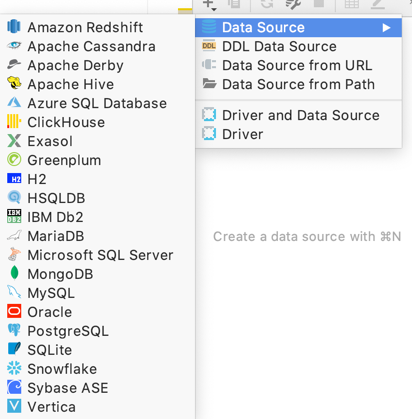

1.介绍数据库 - 数据库类型，适合前端er的mongodb
2.数据库安装，图形化界面和命令行工具
3.数据库创建 - 1）导入导出备份数据库 2）增删改查 3）sql命令保存
4.node框架koa写接口api操作数据库，实现服务端
5.小程序云开发-云服务器，云函数
6.业务sql命令介绍，优化sql技巧

命令行操作数据库：
`注意区分`：SQL语句 和 mysql命令
除了登录命令，其他命令基本需要分号；结尾哦。

1.登录数据库管理系统
```shell script
# 输入
mysql -u root -p # mysql命令
# 回车，然后输入密码 例如：123456

mysql -u root -p123456 truexin_base
```
2.查看存在的数据库列表
```shell script
show databases; # 记得加分号； # mysql命令
```
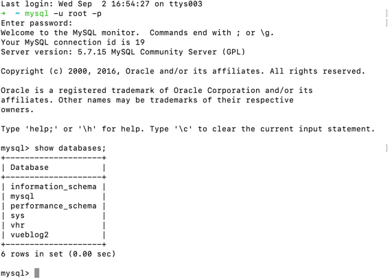

3.创建属于自己的数据库
```shell script
create database truexin_base; # mysql命令

create database truexin_base character set utf8; # 设置自己的编码格式

# 删除数据库
drop database truexin_base;
```

4.使用自己刚创建的数据库truexin_base
```shell script
use truexin_base; # mysql命令

# 设置数据库编码
set names utf8;
```

5.查看当前数据库存在哪些表格
```shell script
show tables; # mysql命令
```

6.创建数据库下面的表格 --- 列属性使用圆括号包着，里面属性名称之间逗号分隔；
```shell script
create table test(name varchar(25),password varchar(25)); # 例1

create table student  # 例2
  (
    sno char(9) primary key,  # 列级完整性约束条件，sno是主码

    sname char(20) unique,   # sname 取唯一值 

    ssex char(2),

    sage smallint,

    sdept char(20)
  );

create table test_from_sign (id int not null,name varchar(50) null); # 例3
 
create table students (name,age,gender,grade); # 例4

create table if not exists `test_tbl`(
   `test_id` int unsigned auto_increment,
   `test_title` varchar(100) not null,
   `test_author` varchar(40) not null,
   `submission_date` date,
   primary key ( `test_id` )
)engine=innodb default charset=utf8; # 例5

create table lang (

name varchar(32) not null primary key,

age int unsigned not null

) engine = InnoDB COLLATE=utf8_general_ci; # 例6

# 删除数据表
drop table new_student;

# 查看数据表
desc test_tbl;

```
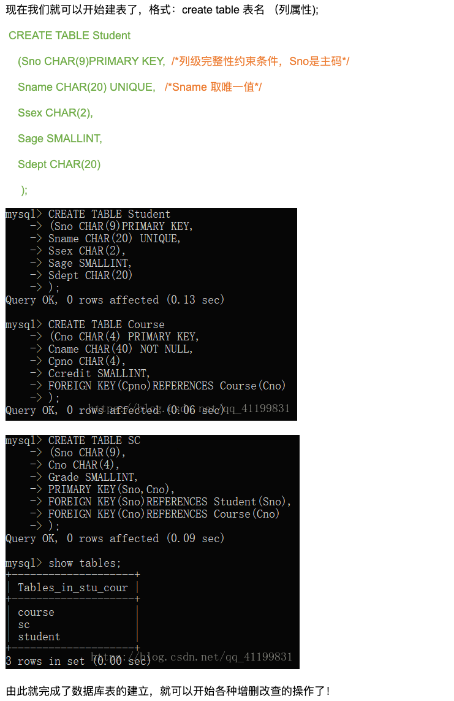

7.向数据库的数据表插入一条数据 
```shell script
# INSERT INTO table_name ( field1, field2,...fieldN ) VALUES ( value1, value2,...valueN );
insert into students (name,age,gender,grade) values ('alex',23,'male',88);

insert into test_tbl (test_title, test_author, submission_date) values ("java 教程", "runoob.com", '2016-05-06');
insert into test_tbl (test_title, test_author, submission_date) values ("java 教程1", "runoob.com1", NOW());
insert into test_tbl (test_title, test_author, submission_date) values ("java 教程33", "吐信", NOW());

# 一次性插入多条数据
insert into students (name) values ('1234'),('okcn');
```

8.查看根据条件查看数据表存储的数据内容
```shell script
select name,gender,age,grade from students where name='alex';
```
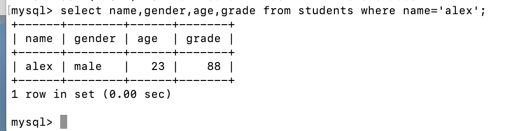

9.向表中添加和删除一列
```shell script
#  语法：alter table 表格名 add 字段名
# 数据类型 -alter table table_name add col_name char(5)
alter table students add school varchar(35);
alter table students add id int;

# 修改变长文本型字段的大小：
# alter table [表名] modify [字段名] varchar(N);
alter table students modify column id char;

alter table students drop school;

# 修改数据表某列的表名称
# 1、在oracle数据库中： ALTER TABLE 表名 RENAME COLUMN 列名 TO 新列名。
# 2、在sqlserver数据库中：exec sp_rename '[表名].[列名]‘，’[表名].[新列名]'。
# 3、在mysql数据库中：ALTER TABLE 表名 CHANGE 列名 新列名 列类型。
alter table test change contry country char;

alter table test modify country varchar(225) CHARACTER SET utf8;
alter table students modify school varchar(225) CHARACTER SET utf8;
update students set school='中山大学';

```
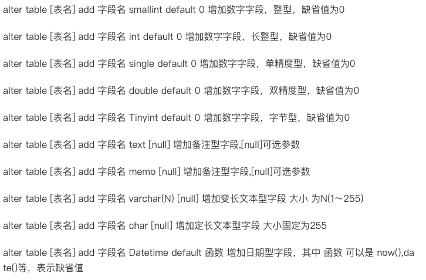
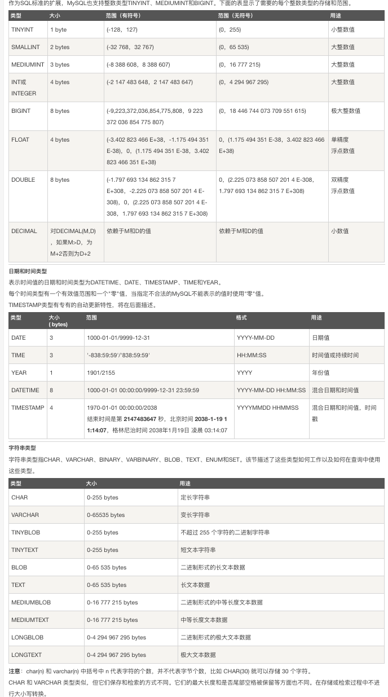

10.查看数据表内容信息
```shell script
# 查看数据表所有列信息
show colums from students; 
 # 等价于
desc students;

# 查看数据表所有信息
select * from test_tbl;
```

11.查询语句 sql命令不区分大小写
```shell script
select * from test_tbl where test_author='吐信';
select * from test_tbl where test_author='RUNOOB.COM';
select * from test_tbl where binary test_author='RUNOOB.COM';
# 实例中使用了 binary 关键字，是区分大小写的，所以 test_author='RUNOOB.COM' 的查询条件是没有数据的。
select * from test_tbl where binary test_author='runoob.com';

SELECT * from test_tbl WHERE test_title like 'java%'; # 以java开头的所有记录
SELECT * from test_tbl WHERE test_author like '%COM'; # 以com结尾的所有记录

# MySQL union 操作符用于连接两个以上的 SELECT 语句的结果组合到一个结果集合中。
# 多个 SELECT 语句会删除重复的数据。
# UNION 语句：用于将不同表中相同列中查询的数据展示出来；（不包括重复数据）
# UNION ALL 语句：用于将不同表中相同列中查询的数据展示出来；（包括重复数据）
# 使用形式如下：
# SELECT 列名称 FROM 表名称 UNION SELECT 列名称 FROM 表名称 ORDER BY 列名称；
# SELECT 列名称 FROM 表名称 UNION ALL SELECT 列名称 FROM 表名称 ORDER BY 列名称；

select name from students union select name from test order by name;
select name from students union all select name from test order by name;
select name from students union all select name from test;

select name,country from students where country='cn' 
union all 
select name,country from test where country='cn'
order by name;

# 查看编码
查看数据库编码：
show create database truexin_base;   
查看表编码：
show create table students;  
查看字段编码：
show full columns from students; 

select age from students union all select age from test order by age asc;
select age from students union all select age from test order by age desc;
select age from students order by age desc;
select * from students order by grade desc;
# 如果字符集采用的是 utf8(万国码)，需要先对字段进行转码然后排序：
select * from test_tbl order by convert(test_title using gbk) desc/asc;

# 导入一个数据表
source /Users/truexin/truexin/frontend-daily-learning/mysql/file/group.sql;
# 修改该数据表名称
alter table employee_tbl rename to group_tbl;

alter table group_tbl engine = myisam;
show table status like 'group_tbl';
# GROUP BY 语句根据一个或多个列对结果集进行分组。在分组的列上我们可以使用 COUNT, SUM, AVG,等函数。
select name,count(*) from group_tbl gruop by name;
select name,sum(singin) from group_tbl group by name with rollup;
# 可使用 coalesce 来设置一个可以取代 NUll 的名称，coalesce 语法： 相当于js 或者 => false || 1;
# old_name as new_name 可以修改显示名称
select coalesce(name,'总数'),sum(singin) from group_tbl group by name with rollup;
select coalesce(name,'总数'),sum(singin) as singin_count from group_tbl group by name with rollup;
select coalesce(name,'总数') as 'name-总数',sum(singin) as '数量-总数' from group_tbl group by name with rollup;

# 跨表连接查看
# inner join = join
select a.name,a.country,b.school from test a inner join students b on a.name = b.name;
# join
select a.name,a.country,b.school from test a join students b on a.name = b.name;
# WHERE 子句
select a.name,a.country,b.school from test a,students b where a.name = b.name;

# 匹配左边全部，匹配不上的字段在显示null，以test为准；
select a.name,a.country,b.school from test a left join students b on a.name=b.name;
# 匹配右边全部，匹配不上的字段在显示null，以students为准；
select a.name,a.country,b.school from test a right join students b on a.name=b.name;


# null值处理
select * from students where address = null; # 无效
select * from students where address != null; # 无效
select * from students where address is null; # 查询address===null
select * from students where address is not null; # # 查询address!==null

# 正则表达式匹配
select name from students where name regexp 'com$';
select name from students where name regexp '^fa';
select name from students where name regexp 'alex';
select name from students where name regexp '^a|y$';
select name from students where name regexp '^[12345]|cn$';

# between
select * from students where age between 23 and 30;
select * from students where age in(23,30);
```
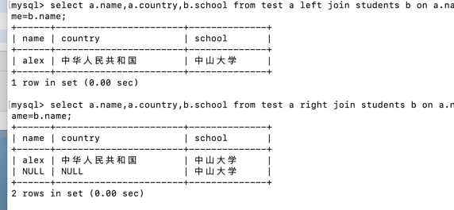

12.更新语句
```shell script
alter table students add id int;
alter table students modify id char;
alter table students modify id varchar(34);
select * from students;
select name form students;
insert into students (name,age,gender) values ('alice',27,'female');
update students set id=1;
update students set id=2 where age=27;
update students set id=2,name='feby' where age=27;
delete from students where name='tom';
delete from students where id=2;

alter table students change school varchar(200) character set utf8 collate utf8_general_ci;
alter table students convert to character set character_name character　set　utf8　collate　utf8_general_ci; 

alter table students add student_id varchar(225) first; # 添加列到第一列
alter table students add class_id varchar(25) after id; # 添加列到id列之后的一列

alter table students add test_label varchar(10);
alter table students change test_label test1_label bigint;
alter table students change test1_label test1_label int;

alter table students alter test1_label set default 100;
update students set test1_label=1;
alter table students modify test1_label bigint not null default 100;  # 可能会报错，需要先把对字段设置为非null

alter table students modify test1_label ini first|after id;

alter table students add t_id int(11) primary key auto_increment;  # 添加设置递增的主键id
alter table students add c_id int unsigned not null auto_increment primary key;

alter table students add i int(6);
alter table students modify i int not null;
alter table students add primary key (i);
alter table students drop primary key;
# 添加索引/删除索引
alter table students add id int(6);
alter table students add index (id);
alter table students drop index id;

```

13.事务
```shell script
# begin; commit; rollback;
create table transaction_test (id int(5));
select * from transaction_test;
begin;
insert into transaction_test value(5);
insert into transaction_test value(6);
commit;
select * from transaction_test;
begin;
insert into transaction_test value(7);
rollback;
select * from transaction_test;

# savepoint 子事务
begin;
update table1 set name='alex1' where name='alex';
select * from table1; # alex1
savepoint a;
update table1 set name='alex2' where name='alex1';
select * from table1; # alex2
rollback to a;
select * from table1; # alex1
rollback; # alex 
# commit 或者 新的事务begin执行 或者 exit;退出mysql都会直接保存；
```
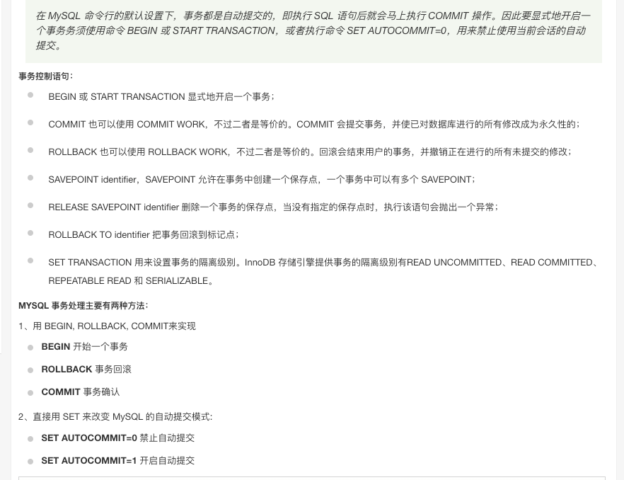

14.运算符
```shell script
select 2=3;
```
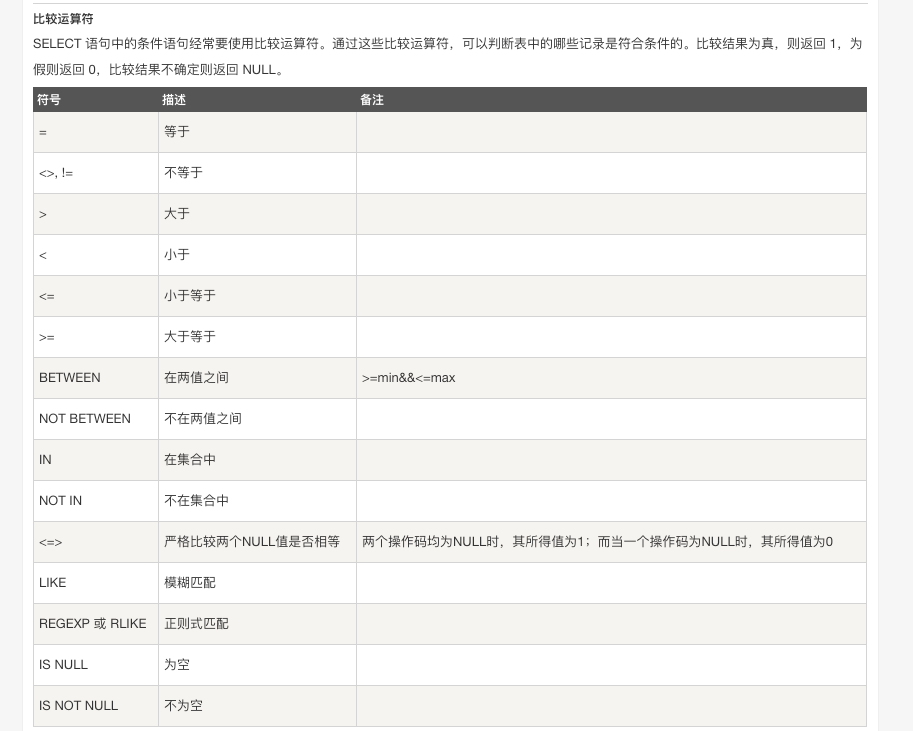

15.临时表
```shell script
create temporary table temp_tbl as (
  select * from students limit 10,10000
);

create temporary table temp_tbl (name,age,id);
insert into temp_tbl (name,age,id) values ('alex',27,123456);
```

16.复制表
```shell script
# 方法1
show create table students \g;


# 方法2
create table new_tbl like students;
insert into new_tbl select * from students;
```
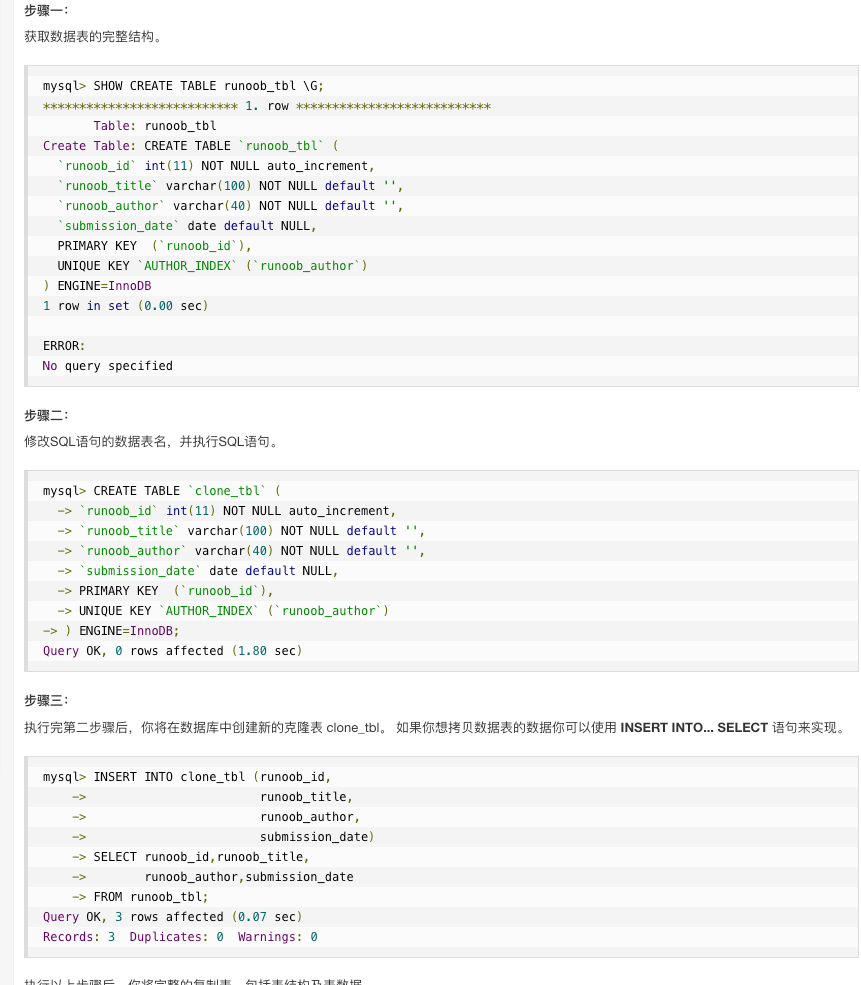
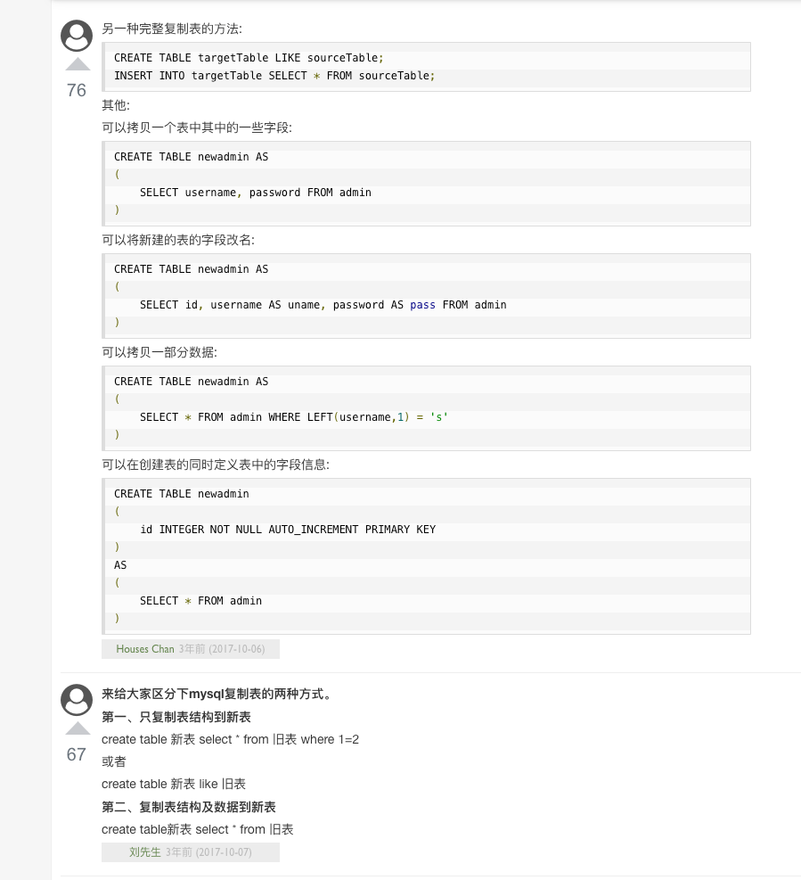

## 初始化数据，导入数据库
```shell script
source 路径和文件名称; # (这里自定义了一个数据库）

mysql -uroot -p123456 < runoob.sql

load data local infile 'dump.txt' into table mytbl;

mysqlimport -u root -p --local mytbl dump.txt


create database abc;      # 创建数据库
use abc;                  # 使用已创建的数据库 
set names utf8;           # 设置编码
source /home/abc/abc.sql  # 导入备份数据库
```

## 导出我自己创建的数据库，保存为.sql格式
```shell script
# 1）导出整个数据库
# mysqldump -u 用户名 -p 数据库名 > 导出的文件名 # 没有输入密码，故需要输入密码
# mysqldump -u 用户名 -p 密码 数据库名 > 数据库名.sql # 不需要再次输入密码了
# 2）导出一个表
# mysqldump -u 用户名 -p 数据库名 表名 > 导出的文件名

mysqldump -u dbuser -p dbname users > dbname_users.sql

mysqldump -u root -p vueblog2 > vueblog2.sql;

mysqldump -u root -p truexin_base > test.sql;
```

## 退出mysql命令行模式；
```shell script
exit;
```

默认就是瑞典latin1,一下是换成我们自己的编码，如utf8:
外部访问数据乱码的问题就出在这个connection连接层上,解决方法是在发送查询前执行一下下面这句：
1. SET NAMES ‘utf8’;
它相当于下面的三句指令：
SET character_set_client = utf8;
SET character_set_results = utf8;
SET character_set_connection = utf8;
一般只有在访问之前执行这个代码就解决问题了，下面是创建数据库和数据表的，设置为我们自己的编码格式。
2. 创建数据库
mysql> create database name character set utf8;
3. 创建表
CREATE TABLE type (
id int(10) unsigned NOT NULL auto_increment,
flag_deleted enum(‘Y’,‘N’) character set utf8 NOT NULL default ‘N’,
flag_type int(5) NOT NULL default ‘0’,
type_name varchar(50) character set utf8 NOT NULL default ‘’,
PRIMARY KEY (id)
) DEFAULT CHARSET=utf8;
4. 修改数据库成utf8的.
mysql> alter database name character set utf8;
5. 修改表默认用utf8.
mysql> alter table type character set utf8;
6. 修改字段用utf8
mysql> alter table type modify type_name varchar(50) CHARACTER SET utf8;


https://www.cnblogs.com/-831/p/11609053.html


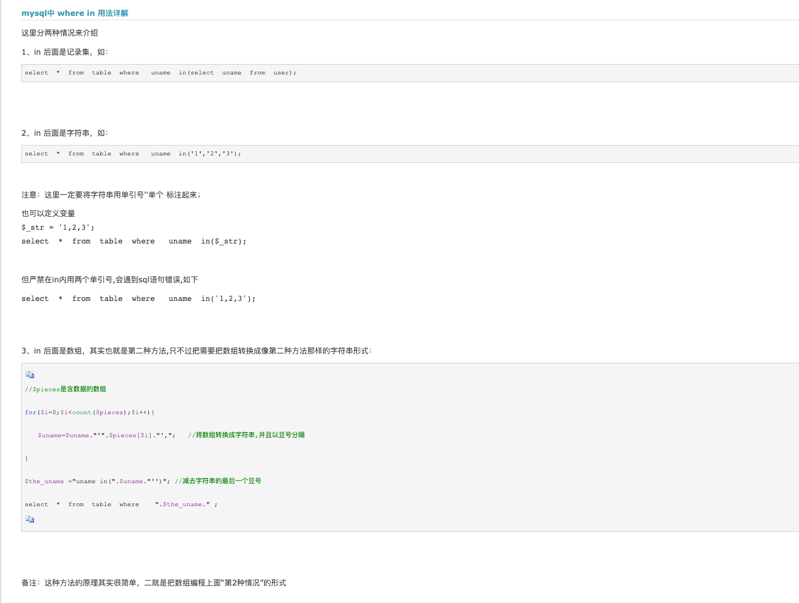

### sql中的等于和不等于， '=' ,'!=','<>','is null'....

不等于：<> ,!=,~= ,^= 这四个符号据说都可以在oracle中表示不等于，
但是试了之后发现<> ,!= ,^=是可以的，~=不行,需要注意的是，只有<>是标准的sql语法，可以移植，
其他的都是oracle平台的特性，移植性较差，所以开发中，尽量使用<>表示不等于

等于：=不用多说，但是要进行null的等于判断时，须使用is null 或is not null，
null只能通过is null或者is not null来判断，其它操作符与null操作都是false。 

例子，select * from bl_ip_dt where amount <> 800,这条语句查不出amount等于null 的记录，

select * from bl_ip_dt where amount <> 800 or amount is null 才是可以的


## MySql中的事务嵌套 问题
1、Mysql中的事务必须是InnoDB、Berkeley DB引擎，myisam不支持。
2、Mysql是不支持嵌套事务的，开启了一个事务的情况下，再开启一个事务，会隐式的提交上一个事务。
3、Mysql默认是autocommit=1，也就是说默认是立即提交，如果想开启事务，先设置autocommit=0，
然后用START TRANSACTION、 COMMIT、 ROLLBACK来使用具体的事务。
4、 fastapp的事务嵌套，原理和代码都很简单，使用了一个trans_count的变量来标识当前事务的层级，
默认为0，每次调用开启事务时计数器加1，事务提交或者回滚时，计数器减1。当计数器为0时，认为是最外层事务时实际触发mysql的事务操作。 
5、 事务控制要成对出现，有开启，必有提交和回滚，如果不匹配导致事务计时器错误，偏离预期的控制效果
6、事务一般配合try catch异常处理语句一起实现，try包裹的语句体内，如果有错误，应该主动抛出异常，
在catch内进行回滚操作，而不能直接在异常处回滚

7.但savepoint 可以满足需求
```mysql
begin;
update table1 set seq=1 where id=4;
savepoint A;
update table1 set seq=2 where id=4;
rollback to savepoint A;
select * from table1 where id=4;
```


#### 例子：
```mysql
# 创建表
CREATE TABLE `student` (
  `id` int(11) NOT NULL COMMENT '学号',
  `name` varchar(60) NOT NULL COMMENT '姓名',
  `birth` date NOT NULL COMMENT '出生日期',
  `sex` varchar(1) DEFAULT NULL,
  `age` int(11) NOT NULL,
  `score` int(11) NOT NULL,
  PRIMARY KEY (`id`)
);

insert into student values(1,'Tom','1998-10-01','男',23,96),(2,'Jim','1997-07-04','男',24,95),(3,'Lily','1999-11-12','女',21,99),(4,'Lilei','1996-09-21','男',25,90),(5,'Lucy','1999-12-02','女',21,93),(6,'Jack','1988-04-27','男',32,89),(7,'Liam','1991-09-08',' 男',28,100);

alter table student modify sex varchar(200) CHARACTER SET utf8; # 设置列支持中文

# 分组
select id,name,score from student where score >95  group by id,name,score;
select id,name,score from student where score >95  group by id;

# 如果name列是主键或者是唯一的非空列，name上面的查询是有效的。
# 这种情况下，MySQL能够识别出select中的列依赖于group by中的列。
# 比如说，如果name是主键，它的值就决定了 address的值，因为每个组只有一个主键值，分组中的每一行都具有唯一性，因此也不需要拒绝这个查询。
select id,name,score from student where score >95  group by name;  # 报错
select id,name,score from student where score >95  group by score;  # 报错

# 解决方法1
alter table student add unique(name); 
select id,name,score from student where score >95  group by name; # 正常执行

# 解决方法2
# 查询
select @@sql_mode;

# 设置 - sql_mode动态去除ONLY_FULL_GROUP_BY限制
SET @@sql_mode = sys.list_drop(@@sql_mode, 'ONLY_FULL_GROUP_BY');
select id,name,score from student where score >95  group by score; # 正常执行
# 设置 - sql_mode动态增加ONLY_FULL_GROUP_BY限制
SET @@sql_mode = sys.list_add(@@sql_mode, 'ONLY_FULL_GROUP_BY');
select id,name,score from student where score >95  group by score; # 报错
```
