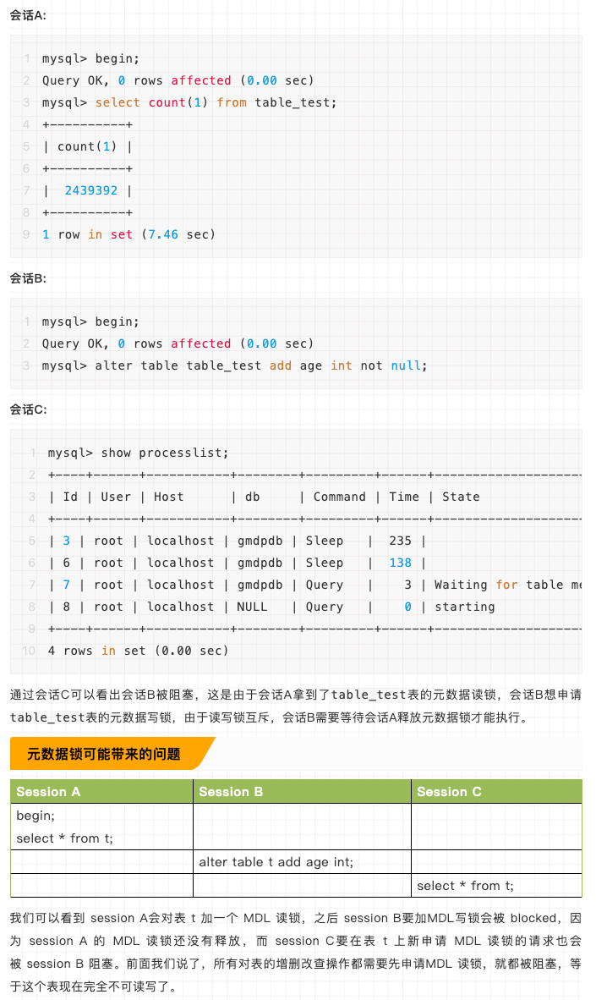

https://blog.csdn.net/WSYW126/article/details/105324239
https://mp.weixin.qq.com/s/7Ri60MZ3HjP8KYBXhjph8w
https://blog.csdn.net/eternal_yangyun/article/details/101037977

## 一．为什么要加锁？
数据库锁机制简单来说，就是数据库在多事务并发处理时，为了保证数据的一致性和完整性，
数据库需要合理地控制资源的访问规则。锁是一种资源，这个资源是和事务关联在一起的，
当某个事务获取了锁，在提交或回滚之前，就一直持有该锁。

## 二．锁的分类
1)根据锁类型划分
共享锁（读锁）：其他事务可以读，但不能写。
排他锁（写锁）：其他事务不能读取，也不能写。
2)根据加锁的范围划分
全局锁、表锁和行锁三类。

### 全局锁:
全局锁就是对整个数据库实例加锁。当你需要让整个库处于只读状态的时候，可以使用这个命令，
之后其他线程的以下语句会被阻塞：数据更新语句（数据的增删改）、数据定义语句（包括建表、修改表结构等）
和更新类事务的提交语句。全局锁的典型使用场景是，做全库逻辑备份。

全局锁的命令：
```mysql
# 方法1
Flush tables with read lock; # 锁库
# 方法2
set global readonly = true # 锁库


unlock tables; # 解锁
```
ERROR 1223 (HY000): Can't execute the query because you have a conflicting read lock

### 表锁:
MySQL 中表级别的锁有三种：表锁、意向锁和元数据锁（meta data lock，MDL)。
表锁的语法是 lock tables … read/write，可以用 unlock tables 主动释放锁，也可以在客户端断开的时候自动释放。
意向锁主要分为意向共享锁和意向互斥锁。
意向共享锁，事务想要给数据库某些行加共享锁，需要先给这张表加上意向共享锁。
意向互斥锁，事务想要给数据库某些行加互斥锁，需要先给这张表加上意向互斥锁。
意向锁主要是解决行锁和表锁的冲突问题。假设没有意向锁，事务A用行锁锁住其中一行，事务B申请表的互斥锁，
然后修改整个表，行锁和表锁就会发生冲突，事务B想知道事务A锁住了哪一行，就需要遍历整张表，这是一个非常耗时的操作。
引入意向锁之后，事务A在加行锁之前先给表加上意向锁，这样如果事务B来获取表锁，需要先判断表上是否有意向锁，
如果有意向锁则阻塞，等待事务A的锁释放。
MDL(metadata lock)是用来保护表的元数据信息的，不需要显式使用，在访问一个表的时候会被自动加上，
MDL的作用是维护数据的一致性，主要解决DML和DDL操作之间的一致性问题。
```mysql
# lock tables tbl_name {read | write},[ tbl_name {read | write},……] 
lock tables table1 read;

unlock tables;
```
ERROR 1099 (HY000): Table 'table1' was locked with a READ lock and can't be updated


注意：以上两个锁表语句在执行的时候都需要注意个特点，就是隐式提交的语句,
在退出mysql终端的时候都会隐式的执行unlock tables,也就是如果要让表锁定生效就必须一直保持对话。

### 行锁
MySQL 的行锁是在引擎层由各个引擎自己实现的。但并不是所有的引擎都支持行锁，
比如MyISAM 引擎就不支持行锁。不支持行锁意味着并发控制只能使用表锁，对于这种引擎的表，
同一张表上任何时刻只能有一个更新在执行，这就会影响到业务并发度。InnoDB 是支持行锁的，
这也是 MyISAM 被 InnoDB 替代的重要原因之一。
行锁又分为三种，单个行记录的锁（record  lock）、间隙锁（GAP  Lock）、记录锁和间隙锁的组合（next-key  Lock）。

## 三．MDL锁 - 元数据锁（mete data lock，MDL）
MySQL5.5引入了meta data lock，简称MDL锁，属于表锁范畴。MDL 的作用是，保证读写的正确性。
你可以想象一下，如果一个查询正在遍历一个表中的数据，而执行期间另一个线程对这个表结构做变更，
增加了一列，那么查询线程拿到的结果跟表结构对不上，肯定是不行的。因此，当对一个表做增删改查操作的时候，
加 MDL读锁；当要对表做结构变更操作的时候，加 MDL 写锁。读锁之间不互斥，因此你可以有多个线程同时对一张表增删改查。
读写锁之间、写锁之间是互斥的，用来保证变更表结构操作的安全性。

### 元数据锁的使用场景模拟

通过会话C可以看出会话B被阻塞，这是由于会话A拿到了table_test表的元数据读锁，
会话B想申请table_test表的元数据写锁，由于读写锁互斥，会话B需要等待会话A释放元数据锁才能执行。

我们可以看到 session A会对表 t 加一个 MDL 读锁，之后 session B要加MDL写锁会被 blocked，
因为 session A 的 MDL 读锁还没有释放，
而 session C要在表 t 上新申请 MDL 读锁的请求也会被 session B 阻塞。
前面我们说了，所有对表的增删改查操作都需要先申请MDL 读锁，就都被阻塞，等于这个表现在完全不可读写了。
