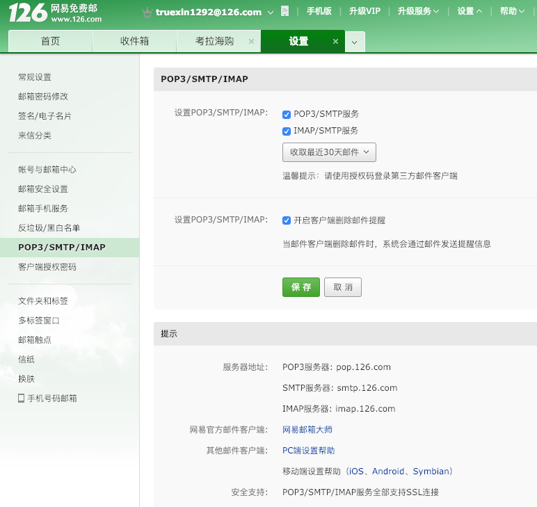

# NodejsGetScreenshotSend
Nodejs获取桌面截图，并定时发送给指定邮箱

## 1.安装相关包
```
npm install --save screenshot-desktop //截图
npm install --save nodemailer         //发邮件
npm install --save node-schedule      //定时
```

## 2.`screenshot-desktop`
>截图的包
网址： https://github.com/bencevans/screenshot-desktop

## 3.`nodemailer`
>发邮件用的包
网址： https://nodemailer.com/about/

## 4.`node-schedule`
>定时使用的包
网址： https://github.com/node-schedule/node-schedule

## 5.引入包
```
const screenshot = require('screenshot-desktop')
const nodemailer = require('nodemailer')
const schedule = require('node-schedule')
const fs = require('fs')//nodejs 文件操作的包
```

## 6.配置发送邮件的邮箱
```
var transporter = nodemailer.createTransport({
    host:"smtp服务器地址",
    secure:true,
    port:端口, //端口注意了 分两种，一种是有ssl的一种是没有ssl
    auth: {
        user: "发送的邮箱",
        pass: "密码"
    },
    debug: true // include SMTP traffic in the logs
});
```

## 7.设置定时
>设置每一分钟发送一次
```
var rule = new schedule.RecurrenceRule();
rule.second = 10;
var j = schedule.scheduleJob(rule,function(){

})
```

## 8.设置截图
```
screenshot()
.then((img) => {
	//将截取的图片存入根目录out.jpg
	fs.writeFile('out.jpg', img,function(err){
		if(err){
			throw err
		}
		console.log('written to out.jpg')
	});
})
```

## 9.设置发送的邮件内容
>看了官方的example才知道，图片要写到下面的attachments中，并提供cid，给上面html中的img调用。

```
var message = {
	from:"发送邮件地址",
	to:"接受邮件地址",
	subject:"桌面截图",
	html:'桌面截图：',
	//附加文件，提供cid给上面的img调用
	attachments:[
     	{
           filename: 'out',
           path: __dirname + '/out.jpg',
           cid: 'test' // should be as unique as possible
		}
	]
}
```

## 10.发送邮件
```
transporter.sendMail(message, (error, info) => {
    if (error) {
        console.log('Error occurred');
        console.log(error.message);
        return;
    }
    console.log('Message sent successfully!');
    console.log('Server responded with "%s"', info.response);
    transporter.close();
});
```

https://blog.csdn.net/ning521513/article/details/79217203
