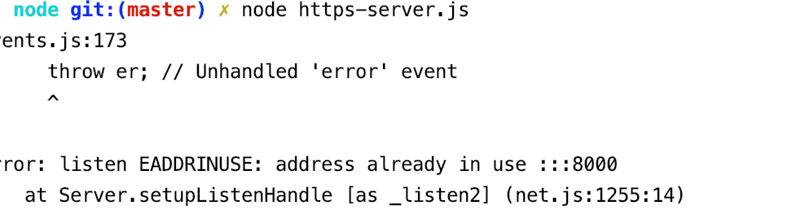
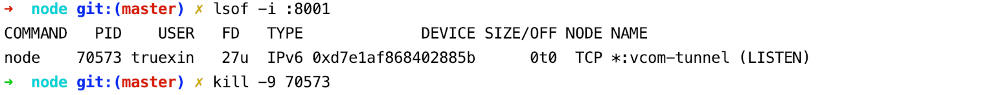

# 项目描述：
https://www.cnblogs.com/dh-dh/p/5111614.html

https://www.barretlee.com/blog/2015/10/05/how-to-build-a-https-server/

https://github.com/solderjs/nodejs-ssl-example

http://www.hacksparrow.com/express-js-https-server-client-example.html

爬取在线html。暂时只支持http。

```node
node index.js 
```

```js
// index.js
var http = require('http');
var url = 'http://frontend.test.fengchaoli.com/';
http.get(url,function(res) {
  var html ='';
  res.on('data',function(data) {
    html+=data;
  })
  res.on('end',function() {
    console.log(html);
  })
}).on('error',function() {
  console.log('获取资源出错！')
})
```

```bash
#1、生成私钥key文件：
openssl genrsa -out privatekey.pem 1024

#2、通过私钥生成CSR证书签名  （需要填一些信息、可直接回车）
openssl req -new -key privatekey.pem -out certrequest.csr

#3、通过私钥和证书签名生成证书文件 
openssl x509 -req -in certrequest.csr -signkey privatekey.pem -out certificate.pem

```

```bash
// 创建私 
$ openssl genrsa -out client.key 1024 
// 生成CSR 
$ openssl req -new -key client.key -out client.csr 
// 生成名证
$ openssl x509 -req -CA ca.crt -CAkey ca.key -CAcreateserial -in client.csr -out client.crt 
```

```js
//最下面
var https = require('https');
var fs = require("fs");

var options = {
    key: fs.readFileSync('./privatekey.pem'),
    cert: fs.readFileSync('./certificate.pem')
};

https.createServer(options, app).listen(3011, function () {
    console.log('Https server listening on port ' + 3011);
});
```

注意：取消端口占用

```bash
//查看端口
lsof -i :port  => lsof -i :8001
kill -9 PID   =>  kill -9 70573
```

