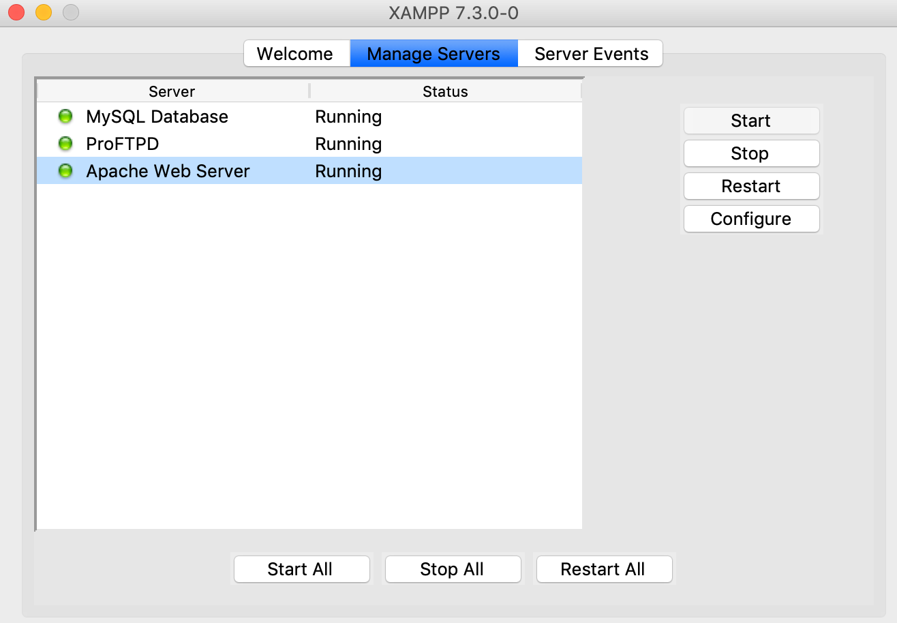

# 项目描述：
https://blog.csdn.net/it_cgq/article/details/79430511
https://blog.csdn.net/wj610671226/article/details/64513919

```bash
http://truexinologydemacbook-pro.local/
```

与mac系统自带的php环境冲突：
先关闭系统php环境
```bash
sudo apachectl stop
```
再打开xampp的php server

#### html里面解析php
https://blog.csdn.net/chengqianduan/article/details/80459456

```html
在html中解析php
想要在html中解析php，发现不是语法不正确，而是没有开apache的解析模块。 
在Apache中开启步骤： 
httpd.conf中添加两行代码： 
AddType application/x-httpd-php .html .htm .php .phtml 
AddType application/x-httpd-php-source .html .htm .phps 
AddType application/x-httpd-php .html .htm
```