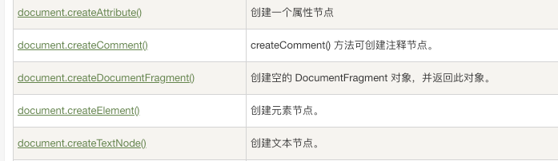
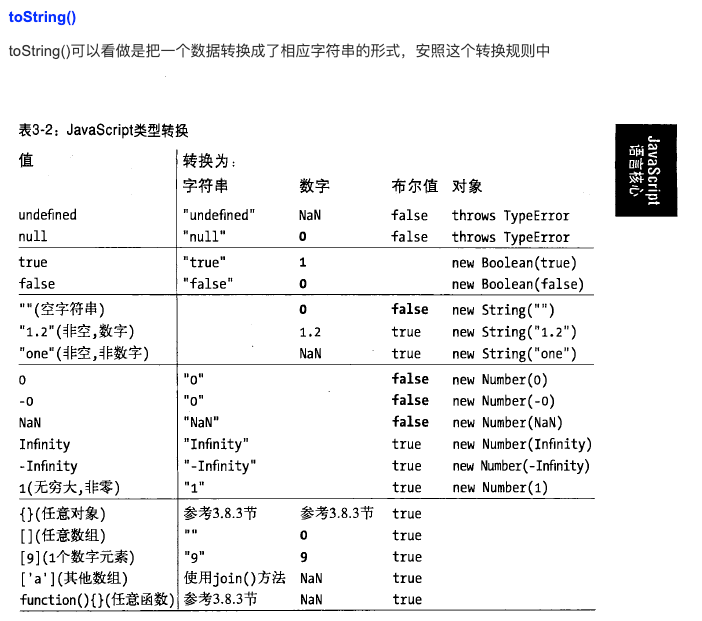
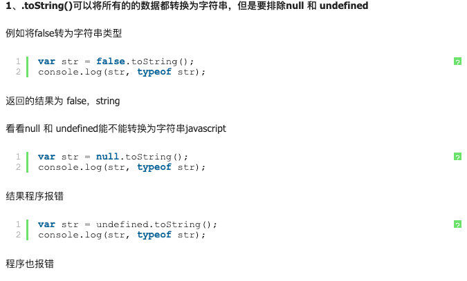
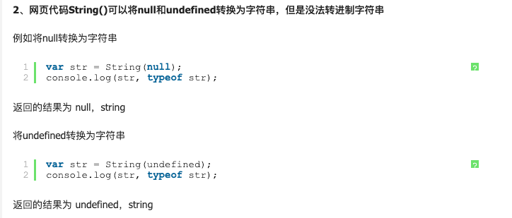

（1）第十五版主要是用于show off,我们把别人写好的一个扫雷游戏前端代码拷贝过来，React.js就用我们刚刚写好的React.js框架，运行成功了，怎么样，是不是对React.js的运行原理有些了解了。到这为止，React中的代码应该重构一下，但是为了更加便于阅读，所以就不改动了，另外，老夫也改不动了。先就到这吧。

class TitleComponent extends React.Component {
    setName() {
        // 设置年龄后姓名丢失
        this.setState({name:'jackie'});
    }
    setAge() {
        // 设置姓名后年龄丢失
        this.setState({age:'27'});
    }
    render() {
        return React.createElement('div',null ,`修改状态`,
                    React.createElement('span',{onClick:this.setName.bind(this)},`    修改姓名---姓名${this.state && this.state.name || undefined} `),
                    React.createElement('span',{onClick:this.setAge.bind(this)},`    修改年龄---年龄${this.state && this.state.age || undefined} `));
    }
}
let myComponent =React.createElement(TitleComponent,null,null);
ReactDOM.render(myComponent, document.getElementById('root'));



```js
document.getElementById("list").hasChildNodes();
document.getElementsByTagName("body")[0].hasChildNodes();
```


一般来说，对象到字符串的转换经过了如下步骤：

1.如果对象具有toString()方法，则调用这个方法。如果它返回一个原始值，js将这个值转换成字符串，并返还这个字符串结果。

2.如果对象没有toString()方法，或者这个方法并不返回一个原始值，那么js将调用valueOf()方法。

3.否则，js无法从toString()或者valueOf()获得一个原始值，因此这时它将抛出一个类型错误异常。

 

一般来说，对象到数字的转换过程中，js做了同样类似的事情，但这里它会首先尝试使用valueOf()方法：

1.如果对象具有valueOf()方法，后者返回一个原始值，则js将这个原始值转换成数字，并返回这个数字。

2.否则，如果对象具有toString()方法，后者返回一个原始值，则js将转换并返回。

（首先js转换成相应的字符串原始值，再继续将这个原始值转换成相应的数字类型，再返回数字）

3.否则，js抛出一个类型错误异常。

https://www.cnblogs.com/imwtr/p/4392041.html





