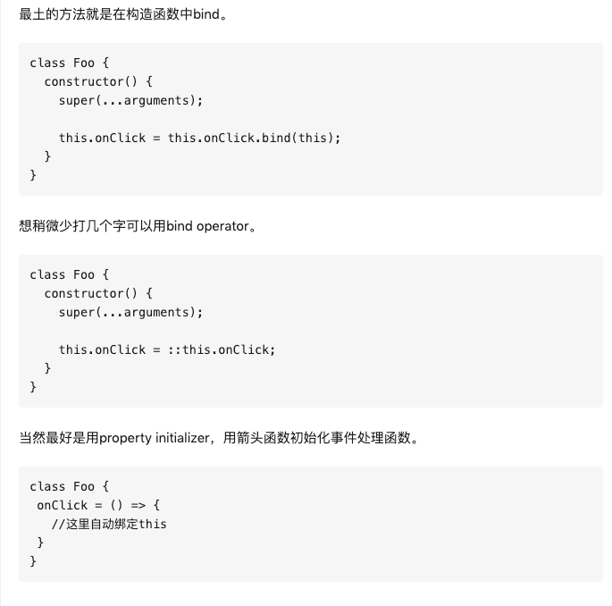

#
> 在线编辑器：https://jsfiddle.net/boilerplate/react-jsx
#
> 本地script方式：react.html

# React.js有哪些设计缺陷？

https://www.zhihu.com/question/316425133/answer/651396919

* 1.子组件无法用于数据
* 2.没有slot支持
* 3.key 是不能作为 props 传递的
* 4.不支持指令
