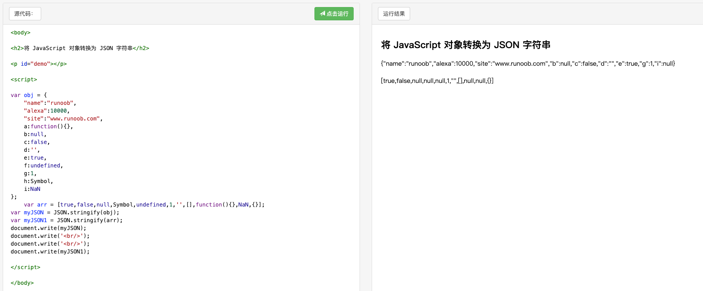

# JSON.stringify

https://developer.mozilla.org/zh-CN/docs/Web/JavaScript/Reference/Global_Objects/JSON/stringify

关于序列化，有下面五点注意事项：

* 非数组对象的属性不能保证以特定的顺序出现在序列化后的字符串中。
* 布尔值、数字、字符串的包装对象在序列化过程中会自动转换成对应的原始值。
* undefined、任意的函数以及 symbol 值，
在序列化过程中会被忽略（出现在非数组对象的属性值中时）
或者被转换成 null（出现在数组中时）。
* 对包含循环引用的对象（对象之间相互引用，形成无限循环）
执行此方法，会抛出错误。
* 所有以 symbol 为属性键的属性都会被完全忽略掉，即便 
replacer 参数中强制指定包含了它们。
* 不可枚举的属性会被忽略




```js
var obj = { 
	"name":"runoob", 
	"alexa":10000, 
	"site":"www.runoob.com",
	a:function(){},
	b:null,
	c:false,
	d:'',
	e:true,
	f:undefined,
	g:1,
	h:Symbol,
	i:NaN,
	"initDate":new Date() //"initDate":"2019-04-19T08:03:14.298Z",
};


var arr = [true,false,null,Symbol,undefined,1,'',[],function(){},NaN,{},new Date()];//"2019-04-19T08:05:01.891Z"
var myJSON = JSON.stringify(obj);
var myJSON1 = JSON.stringify(arr);
document.write(myJSON);
document.write('<br/>');
document.write('<br/>');
document.write(myJSON1);

// {"name":"runoob","alexa":10000,"site":"www.runoob.com","b":null,"c":false,"d":"","e":true,"g":1,"i":null}

// [true,false,null,null,null,1,"",[],null,null,{}]
```

```js
JSON.stringify(document);

// "{
//      "location":{
//          "href":"http://www.runoob.com/try/try.php?filename=tryjson_stringify2", 
//          "ancestorOrigins":{"0":"http://www.runoob.com"},
//          "origin":"http://www.runoob.com",
//          "protocol":"http:",
//          "host":"www.runoob.com",
//          "hostname":"www.runoob.com",
//          "port":"",
//          "pathname":"/try/try.php",
//          "search":"?filename=tryjson_stringify2",
//          "hash":""
//      }
// }"

JSON.stringify(location);

// "{
//      "href":"http://www.runoob.com/try/try.php?filename=tryjson_stringify2",
//      "ancestorOrigins":{"0":"http://www.runoob.com"},
//      "origin":"http://www.runoob.com",
//      "protocol":"http:",
//      "host":"www.runoob.com",
//      "hostname":"www.runoob.com",
//      "port":"",
//      "pathname":"/try/try.php",
//      "search":"?filename=tryjson_stringify2",
//      "hash":""
// }"

// 不可枚举的属性默认会被忽略：
JSON.stringify( 
    Object.create(
        null, 
        { 
            x: { value: 'x', enumerable: false }, 
            y: { value: 'y', enumerable: true } 
        }
    )
);

// "{"y":"y"}"
```

