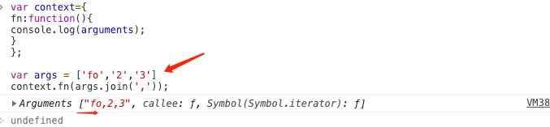

# 项目描述：
call是ES3的方法，所以。哈哈使用ES6的方法模拟就。。。

所以：
```
var args = [1,2,3,4];

eval('context.fn(' + args +')');

=> context.fn(1,2,3,4);

等价于 context.fn(...args);
```

```
// 将数组里的元素作为多个参数放进函数的形参里
context.fn(args.join(','))
// (O_o)??
// 这个方法肯定是不行的啦！！！
```

变成一个参数了

* 模拟实现call函数：
https://www.jianshu.com/p/af3f41d8ef99

* js模拟实现call、apply、bind函数
https://www.jianshu.com/p/3210180162c4

http://web.jobbole.com/91366/
```md
1.将函数设为对象的属性
2.执行该函数
3.删除该函数
```
