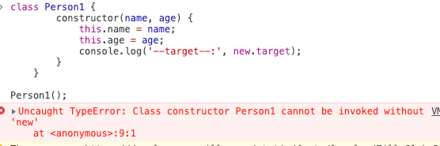

# 项目描述：
1.手写new操作符

https://juejin.im/post/5bde7c926fb9a049f66b8b52

https://developer.mozilla.org/zh-CN/docs/Web/JavaScript/Reference/Operators/new.target

new.target属性适用于所有函数访问的元属性。
在  arrow functions 中，new.target 指向最近的外层函数的
new.target（An arrow function expression does 
not have its 
own this, arguments, super , or new.target) 。


# new操作符做了这些事：

## 它创建了一个全新的对象。

## 它会被执行 [[Prototype]]（也就是 __proto__）链接。

## 它使 this指向新创建的对象。。

## 通过 new创建的每个对象将最终被 [[Prototype]]链接到这个函数的 prototype对象上。

## 如果函数没有返回对象类型 Object(包含 Functoin,Array,Date,RegExg,Error)，那么 new表达式中的函数调用将返回该对象引用。


```js
const createNew = function(func) {
    return function() {
        let obj = {
            __proto__:func.prototype
        }
        func.apply(obj,arguments);
        return obj;
    }
}

const createNew2 = function(func) {
    let obj = {};
    if(func.prototype !== null){
        obj.__proto__ = func.prototype;
    }
    let args = [].slice.call(arguments,1);
    let ret = func.apply(obj,args); 
    if((typeof ret === 'object' || typeof ret ==='function') && ret !==null){
        return ret;
    }
    return obj;
}

const newOperator = function(func){
    if(typeof func !== 'function'){
      throw 'newOperator function the first param must be a function';
    }
    newOperator.target = func;
    var newObj = Object.create(func.prototype);
    var argsArr = [].slice.call(arguments, 1);
    var funcReturnResult = func.apply(newObj, argsArr);
    var isObject = typeof funcReturnResult === 'object' && funcReturnResult !== null;
    var isFunction = typeof funcReturnResult === 'function';
    if(isObject || isFunction){
        return funcReturnResult;
    }
    return newObj;
}

const trueNew = function(func) {
  if(typeof func !== 'function'){
      throw func.name + " is not a constructor";
      // throw "newOperator function the first param must be a function";
  }
  let obj = {};
  if(func.prototype !== null){
      obj.__proto__ = func.prototype;
  }
  let args = Array.prototype.slice.call(arguments,1);
  let funcReturnResult = func.apply(obj,args);
  if( 
      ( 
        typeof funcReturnResult === 'object' 
        && typeof funcReturnResult !== null 
      ) 
      || ( typeof funcReturnResult === 'function' )
    ){
      
  }
}
```




# js手动实现new方法/new操作符具体干了什么呢?
## 1.新生成了一个对象；
## 2.该新对象隐性原型链接到函数原型；
## 3.调用函数绑定this；
## 4.返回新对象；

```js
const newCreate = function(func) {
  return function() {
       let newObj = { // 1
           _proto_:func.prototype, // 2
       }
       func.apply(newObj,arguments); // 3
       return newObj; // 4
  }
}
// todo demo1
var Person = function() { //=》 构造函数-首字母大写
    this.name = 'alex';
    this.gender = 'male';
    this.age = 26;
}
// todo demo2
var Person2 = function(
    name = 'alex',
    gender = 'male',
    age = 26
    ) { 
    //=》 构造函数-首字母大写
    this.name = name;
    this.gender = gender;
    this.age = age;
}
// todo es6 demo3 
class Person3 {
    constructor(name,gender,age) {
        this.name = name;
        this.gender = gender;
        this.age = age;
    }
    
    /*showName = () => {
        console.log(this.name);
    }
    
    showAll = () => {
        console.log(this);
    }*/
    //showName(){
      //  console.log(this.name);
    //}
    function showName(){
        console.log(this.name);
    }
}

var newPerson = newCreate(Person);
var newPerson2 = newCreate(Person2);
var newPerson3 = newCreate(Person3);
console.log(newPerson().name);
console.log(newPerson().gender);
console.log(newPerson().age);

console.log(newPerson2('tom', 'female', 30));
console.log(newPerson3('true', 'male', 38));
```
衍生问题：工厂函数和构造函数区别？
一个构造函数通过new一个新的对象出来使用，
在函数内部通过this来添加对象内部成员，
他只能为对象类型。同时一般我们定义一个构造函数首字母要记得大写。 
而工厂函数是需要在内部创建对象，
并且必须要有return 返回值。 
构造函数可以重写但是工厂函数不可以。 
构造函数通过Person.prototype = {} 

