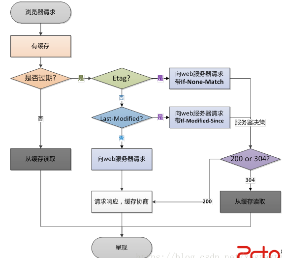

# 项目描述：
https://www.cnblogs.com/y896926473/articles/5686700.html

https://blog.csdn.net/xustart7720/article/details/79960591

http://baijiahao.baidu.com/s?id=1603688536527948251&wfr=spider&for=pc

https://blog.csdn.net/Take_Dream_as_Horse/article/details/53064508

直接影响网站排名,到底是哪些细节影响着文章收录

1、URL中出现关键词

URL链接中包含页面的关键字可以使搜索引擎增加对链接页面以及本页面的关注度，
有利于在百度的收录;

2、网页Title中出现关键词

毫无疑问，所有的SEO们都认可Title中出现关键词对于网页排名的好处;

3、在页面的第一段中出现关键词

搜索引擎似乎特别关注页面的开头以及页面的底部，
似乎在文章开头或者结尾出现关键词有强调关键词的作用，尤其是在文章的第一段，
似乎搜索引擎还在沿用截取的方法获得文章的描述，如果页面没有设定描述的话;

4、在页面的最后一段中出现关键词

页面的最后一段明显有助于搜索引擎的索引spider索引，
毕竟大部分的站点友情链接是在那个地方，况且copyright范围也能够加深搜索引擎的影响;

5、常规内容中出现关键词

适当的关键词密度有利于页面在搜索引擎索引中获得好的名次。

6、站内的链接中出现关键词

和站外的链接中出现关键词没有任何区别。

7、导向相关内容的导出链接

不要怀疑，页面中的任何链接都会得到搜索引擎的关注;

8、导出链接中出现关键词

带链接的关键词由于链接的存在而被加强

9、Heading 标签 比如h1，h2中出现关键词

不用多余的解释，h1、h2标签似乎专为搜索引擎设计;

10、图片文件名中出现关键词

文件名是浏览网址的一部分，这似乎和域名中包含关键词有异曲同工之妙;

11、Alt标签中出现关键词

一般情况下图片链接对于搜索引擎的友好程度比不上文字链接，所以html语言才设计了Alt标签;

12、comment中出现关键词

虽然作用在不断的减低，但始终是搜索引擎排名的依据之一;

13、合理的频率更新内容

似乎没有什么合理的说法，搜索引擎喜欢更新更快的网站，但是请不要更新的速度剧烈的波动;

14、内容对搜索引擎的展示位置

这一点要说的是，请把内容的主体部分放在页面的靠前位置

15、网站结构循环PR，而非散发PR

不要仅仅关注pr，这么做同样有助于提高百度的网页权重

16、关键词进行适当的修饰(加粗、斜体、strong、下划线等)

----

* 1.合理的title、description、keywords：搜索对着三项的权重逐个减小，
title值强调重点即可，重要关键词出现不要超过2次，而且要靠前，
不同页面title要有所不同；description把页面内容高度概括，
长度合适，不可过分堆砌关键词，不同页面description有所不同；
keywords列举出重要关键词即可

* 2.语义化的HTML代码，符合W3C规范：语义化代码让搜索引擎容易理解网页

* 3.重要内容HTML代码放在最前：搜索引擎抓取HTML顺序是从上到下，
有的搜索引擎对抓取长度有限制，保证重要内容一定会被抓取

* 4.重要内容不要用js输出：爬虫不会执行js获取内容

* 5.少用iframe：搜索引擎不会抓取iframe中的内容

* 6.非装饰性图片必须加alt

* 7.提高网站速度：网站速度是搜索引擎排序的一个重要指标

