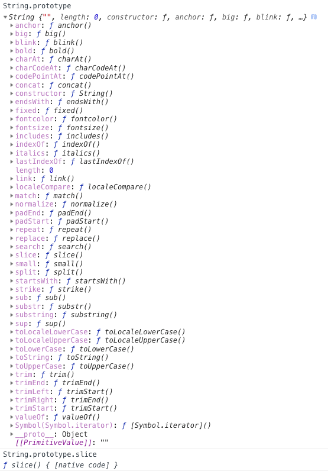
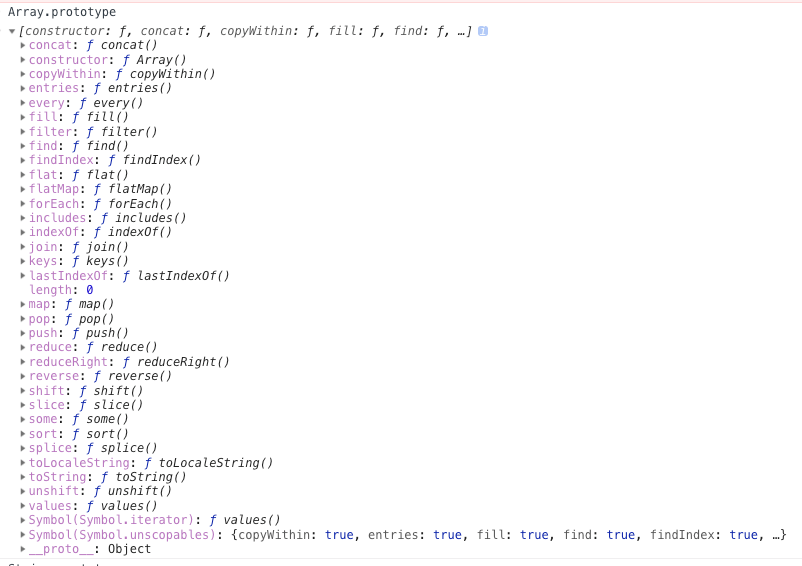
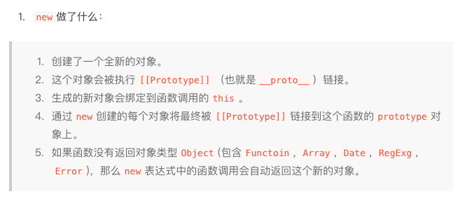

# js各种方法大全

## 1.如何获取文件扩展名？[参考](http://leftstick.github.io/tech/2016/04/23/how-to-get-the-file-extension-more-efficiently)
https://jsbin.com/tipofu/edit?js,console

### String.prototype



### Array.prototype




## 2.模拟实现new 操作符
[参考](https://juejin.im/post/5bde7c926fb9a049f66b8b52)
```js
// 去除了注释
function newOperator(ctor){
    if(typeof ctor !== 'function'){
      throw 'newOperator function the first param must be a function';
    }
    newOperator.target = ctor;
    var newObj = Object.create(ctor.prototype);
    var argsArr = [].slice.call(arguments, 1);
    var ctorReturnResult = ctor.apply(newObj, argsArr);
    var isObject = typeof ctorReturnResult === 'object' && ctorReturnResult !== null;
    var isFunction = typeof ctorReturnResult === 'function';
    if(isObject || isFunction){
        return ctorReturnResult;
    }
    return newObj;
}

```

注意： 对于不支持ES5的浏览器，MDN上提供了ployfill方案。
---
```js
if (typeof Object.create !== "function") {
    Object.create = function (proto, propertiesObject) {
        if (typeof proto !== 'object' && typeof proto !== 'function') {
            throw new TypeError('Object prototype may only be an Object: ' + proto);
        } else if (proto === null) {
            throw new Error("This browser's implementation of Object.create is a shim and doesn't support 'null' as the first argument.");
        }

        if (typeof propertiesObject != 'undefined') throw new Error("This browser's implementation of Object.create is a shim and doesn't support a second argument.");

        function F() {}
        F.prototype = proto;
        return new F();
    };
}
```

