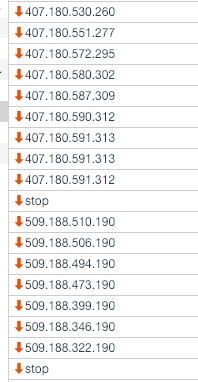
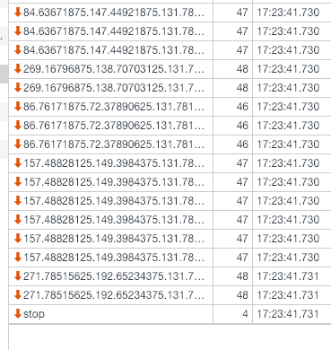

# 项目描述：
https://segmentfault.com/a/1190000012789253
```node
npm init -y
yarn add vue
yarn add webpack webpack-cli webpack-dev-server --dev
```

注意：
----
1.webpack默认不支持转码es6，但是import export这两个语法却单独支持。
----
2.webpack默认只支持js的模块化，如果需要把其他文件也当成模块引入，就需要相对应的loader解析器
```
yarn add node-sass css-loader vue-style-loader sass-loader --dev
```
----
3.ES6的语法大多数浏览器依旧不支持,bable可以把ES6转码成ES5语法，这样我们就可以大胆的在项目中使用最新特性了
  
```
yarn add babel-core babel-loader babel-preset-env babel-preset-stage-3 --dev
```
----
4.非常感谢博主的知识贴，受益匪浅。3.x和4.x有了很多区别，像最后的打包发布，webpack4.x下，压缩代码不在webpack.config.js中写new webpack.optimize.UglifyJsPlugin(),,而是在package.json中的script下面接上：
  "dev": "... --mode development", "build": "... --mode production"
----

5. 官方默认babel-loader | babel 对应的版本需要一致: 即babel-loader需要搭配最新版本babel
----

https://www.cnblogs.com/soyxiaobi/p/9554565.html

//开发时：
"scripts": {
	"dev": "webpack-dev-server --open --hot",
	"build": "webpack --progress --hide-modules"
},
在实际发布时，会对文件进行压缩，缓存，分离等等优化处理
"scripts": {
    "dev": "cross-env NODE_ENV=development webpack-dev-server --open --hot",
    "build": "cross-env NODE_ENV=production webpack --progress --hide-modules"
}

pc:


h5:

