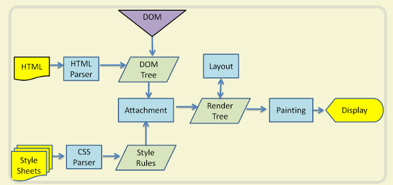

# 项目描述：
http://caibaojian.com/css-reflow-repaint.html
https://blog.csdn.net/OBKoro1/article/details/85057490
http://www.ruanyifeng.com/blog/2015/09/web-page-performance-in-depth.html

1.
`
                         dom (event listen)
                          ||
                          ||
html = > html parse => dom tree 
                          ||           
                          ||           (flow)
                      attachment => render tree => painting (paint) => display (done) 
                          ||            ||  
                          ||            ||  
css = > css parse   =>  cssom         layout
`



```md
HTML代码转化成DOM
CSS代码转化成CSSOM（CSS Object Model）
结合DOM和CSSOM，生成一棵渲染树（包含每个节点的视觉信息）
生成布局（layout），即将所有渲染树的所有节点进行平面合成
将布局绘制（paint）在屏幕上
```

layout:  重排 ，又叫回流。

paint:重绘 也可以在Event Log里看的到，这里就不附图了。

重排重绘这些步骤都是在cpu中发生的。

最后 到  compostite Layers阶段，cpu 把生成的 BitMap（位图）传输到GPU，渲染到屏幕。 css3就是在GPU发生的：transform  opacity。

渲染的三个阶段 Layout ,Paint,Composite Layers。

修改不同的css属性会触发不同阶段。

触发的阶段越前，渲染的代价越高。


### 什么时候会导致reflow发生呢？

* 改变窗口大小
* 改变文字大小
* 添加/删除样式表
* 内容的改变，(用户在输入框中写入内容也会)
* 激活伪类，如:hover
* 操作class属性
* 脚本操作DOM
* 计算offsetWidth和offsetHeight
* 设置style属性
